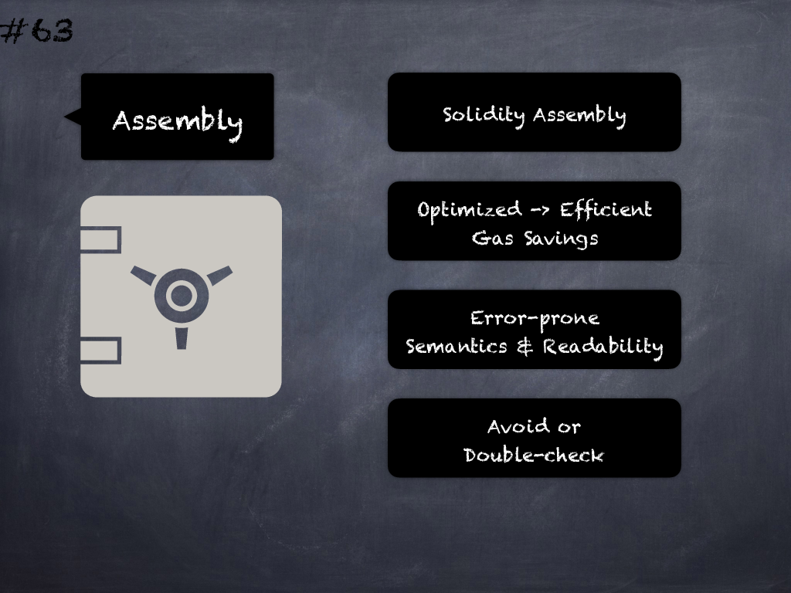

# 63 - [Assembly usage](Assembly%20usage.md)
Use of EVM assembly is error-prone and should be avoided or double-checked for correctness. (see [here](https://github.com/crytic/slither/wiki/Detector-Documentation#assembly-usage))
___
## Slide Screenshot

___
## Slide Text
- 
___
## References
- Youtube Reference
___
## Tags