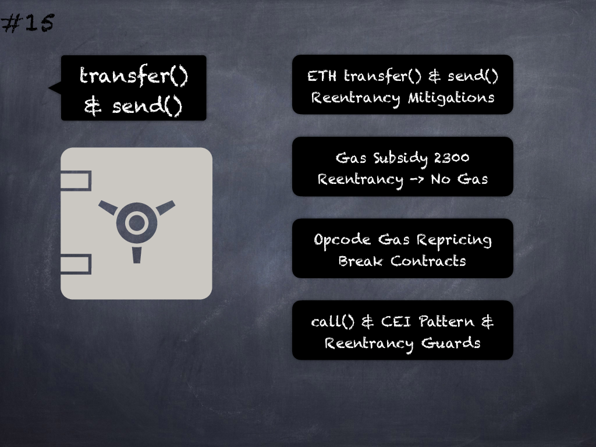

# 15 - [Avoid transfer(), send() as reentrancy mitigations](Avoid%20transfer(),%20send()%20as%20reentrancy%20mitigations.md)
Although _transfer()_ and _send()_ have been recommended as a security best-practice to prevent reentrancy attacks because they only forward 2300 gas, the gas repricing of opcodes may break deployed contracts. Use _call()_ instead, without hardcoded gas limits along with checks-effects-interactions pattern or reentrancy guards for reentrancy protection. (see [here](https://consensys.net/diligence/blog/2019/09/stop-using-soliditys-transfer-now/) and [here](https://swcregistry.io/docs/SWC-134))

___
## Slide Screenshot

___
## Slide Text
- 
___
## References
- Youtube Reference
___
## Tags