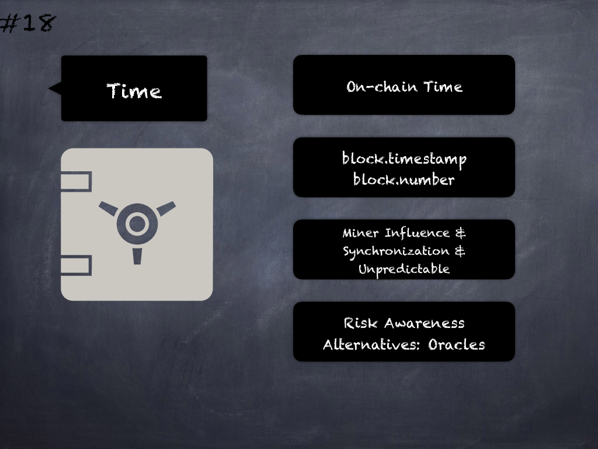

# 18 - [Block values as time proxies](Block%20values%20as%20time%20proxies.md)
_block.timestamp_ and _block.number_ are not good proxies (i.e. representations, not to be confused with smart contract proxy/implementation pattern) for time because of issues with synchronization, miner manipulation and changing block times. (see [here](https://swcregistry.io/docs/SWC-116))
___
## Slide Screenshot

___
## Slide Text
- 
___
## References
- Youtube Reference
___
## Tags