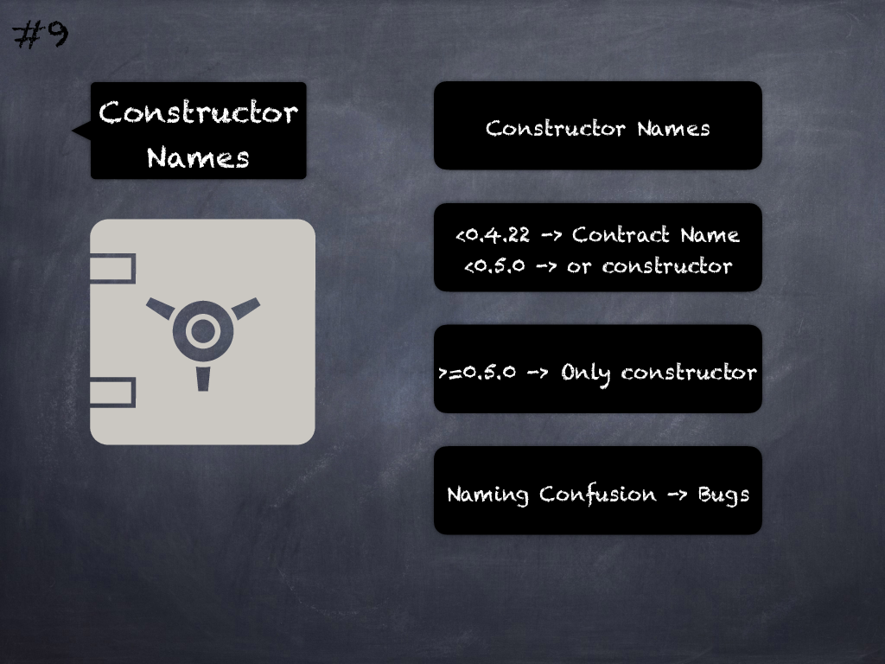

# 9 - [Constructor names](Constructor%20names.md)
 Before `solc 0.4.22`, constructor names had to be the same name as the contract class containing it. Misnaming it wouldn’t make it a constructor which has security implications. `Solc 0.4.22` introduced the `constructor` keyword. Until `solc 0.5.0`, contracts could have both old-style and new-style constructor names with the first defined one taking precedence over the second if both existed, which also led to security issues. `Solc 0.5.0` forced the use of the `constructor` keyword. (see [here](https://github.com/crytic/slither/wiki/Detector-Documentation#multiple-constructor-schemes) and [here](https://swcregistry.io/docs/SWC-118))

___
## Slide Screenshot

___
## Slide Text
- Constructor Names
- `< 0.4.22` -> Contract Name
-`< 0.5.0 `-> or constructor
- `>= 0.5.0` -> Only constructor
- Naming Confusion -> Bugs
___
## References
- [Youtube Reference](https://youtu.be/OOzyoaYIw2k?t=843)
___
## Tags