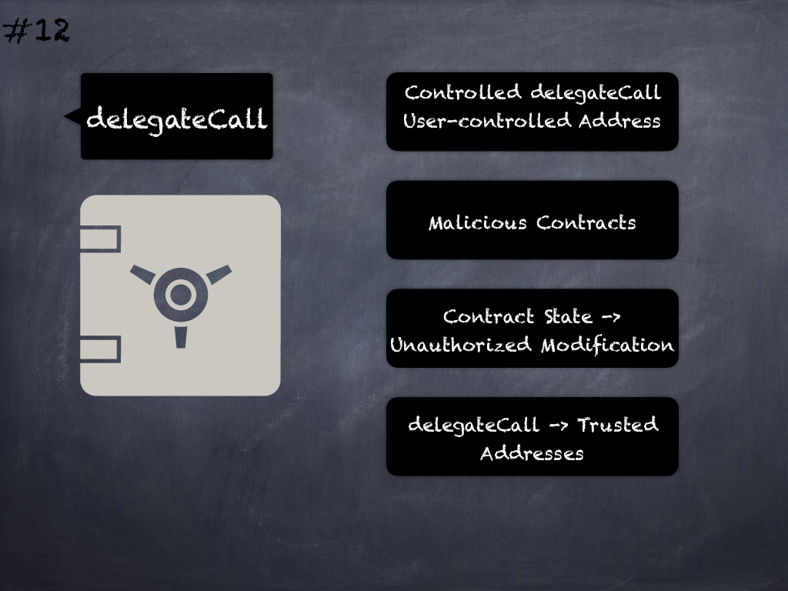

# 12 - [Controlled delegatecall](Controlled%20delegatecall.md)
_delegatecall()_ or _callcode()_ to an address controlled by the user allows execution of malicious contracts in the context of the caller’s state. Ensure trusted destination addresses for such calls. (see [here](https://swcregistry.io/docs/SWC-112))

___
## Slide Screenshot

___
## Slide Text
- 
___
## References
- Youtube Reference
___
## Tags