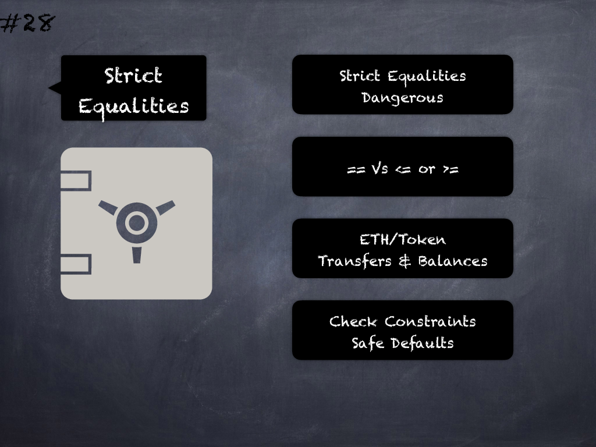

# 28 - [Dangerous strict equalities](Dangerous%20strict%20equalities.md)
Use of strict equalities with tokens/Ether can accidentally/maliciously cause unexpected behavior. Consider using _>=_ or _<=_ instead of `==` for such variables depending on the contract logic. (see [here](https://github.com/crytic/slither/wiki/Detector-Documentation#dangerous-strict-equalities))

___
## Slide Screenshot

___
## Slide Text
- 
___
## References
- Youtube Reference
___
## Tags