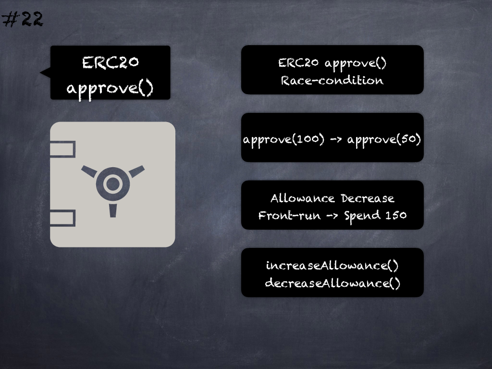

# 22 - [ERC20 approve() race condition](ERC20%20approve()%20race%20condition.md)
Use _safeIncreaseAllowance()_ and _safeDecreaseAllowance()_ from OpenZeppelin’s _SafeERC20_ implementation to prevent race conditions from manipulating the allowance amounts. (see [here](https://swcregistry.io/docs/SWC-114))

___
## Slide Screenshot

___
## Slide Text
- 
___
## References
- Youtube Reference
___
## Tags