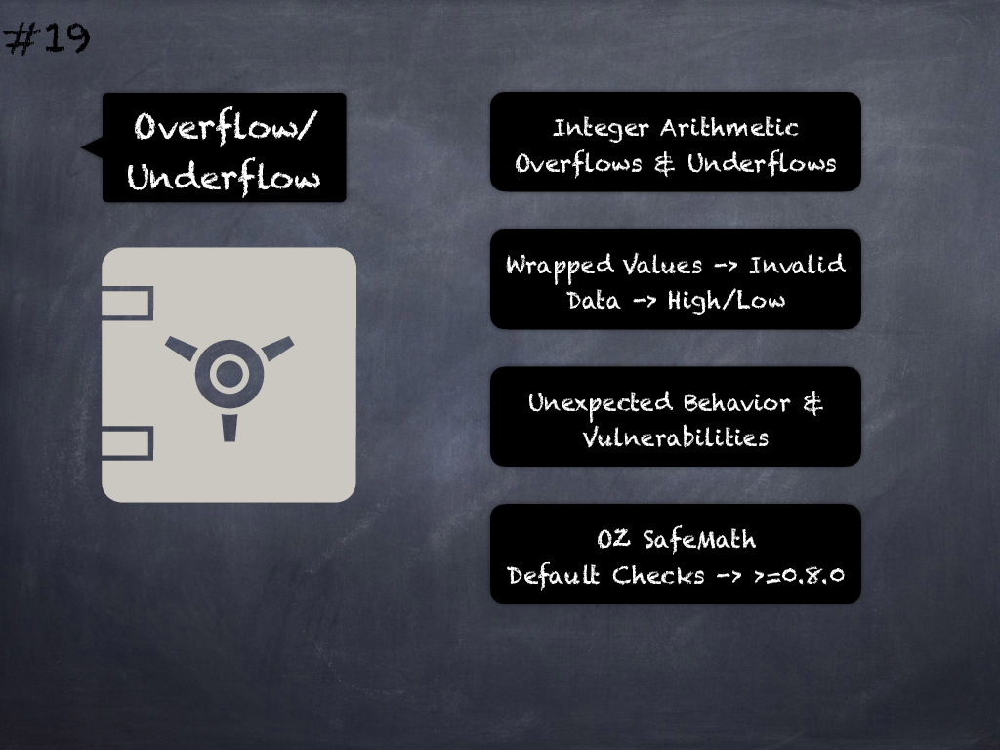

# 19 - [Integer overflow, underflow](Integer%20overflow,%20underflow.md)
Not using OpenZeppelin’s SafeMath (or similar libraries) that check for overflows/underflows may lead to vulnerabilities or unexpected behavior if user/attacker can control the integer operands of such arithmetic operations. _Solc v0.8.0_ introduced default overflow/underflow checks for all arithmetic operations. (see [here](https://swcregistry.io/docs/SWC-101) and [here](https://blog.soliditylang.org/2020/10/28/solidity-0.8.x-preview/))

___
## Slide Screenshot

___
## Slide Text
- 
___
## References
- Youtube Reference
___
## Tags