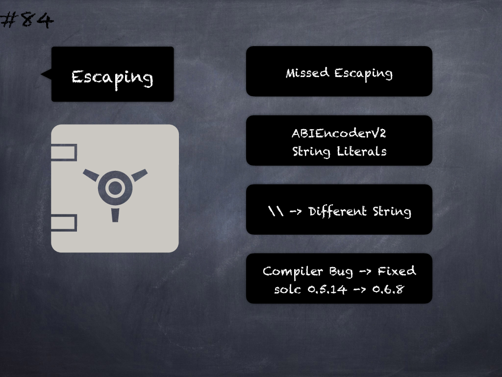

# 84 - [Missing escaping in formatting with ABIEncoderV2](Missing%20escaping%20in%20formatting%20with%20ABIEncoderV2.md)
String literals containing double backslash characters passed directly to external or encoding function calls can lead to a different string being used when ABIEncoderV2 is enabled. This is due to a compiler bug introduced in `v0.5.14` and fixed in `v0.6.8`. (see [here](https://docs.soliditylang.org/en/v0.8.9/bugs.html))
___
## Slide Screenshot

___
## Slide Text
- 
___
## References
- Youtube Reference
___
## Tags