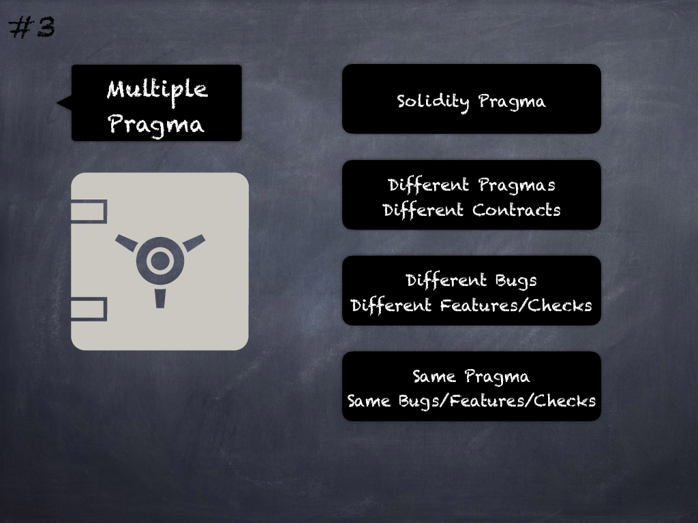

# 3 - [Multiple Solidity pragma](Multiple%20Solidity%20pragma.md)
It is better to use one Solidity compiler version across all contracts instead of different versions with different bugs and security checks. (see [here](https://github.com/crytic/slither/wiki/Detector-Documentation#different-pragma-directives-are-used))

___
## Slide Screenshot

___
## Slide Text
- 
___
## References
- Youtube Reference
___
## Tags