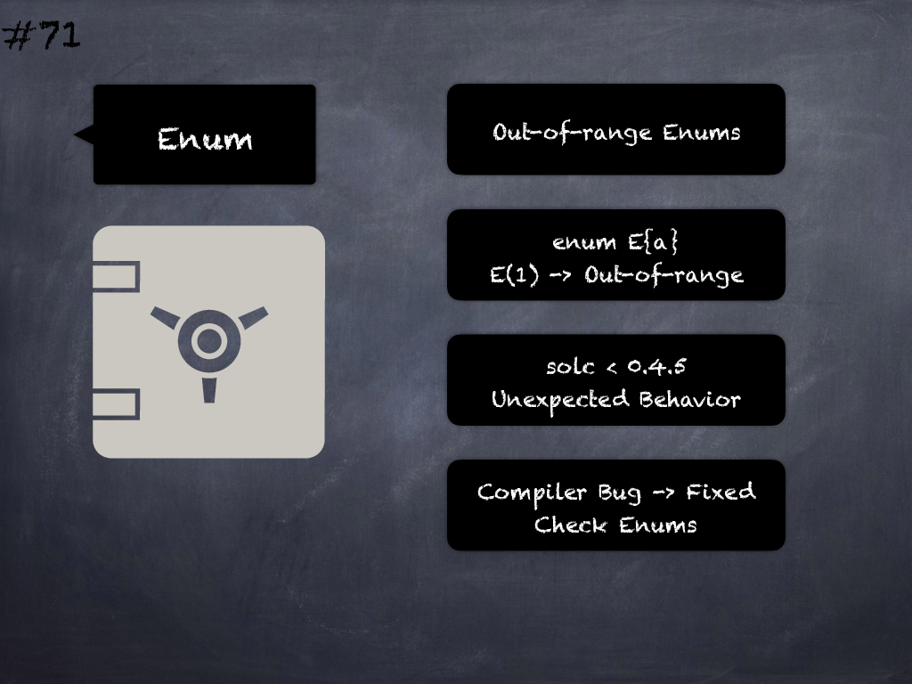

# 71 - [Out-of-range enum](Out-of-range%20enum.md)

_Solc < 0.4.5_ produced unexpected behavior with out-of-range enums_._ Check enum conversion or use a newer compiler. (see [here](https://github.com/crytic/slither/wiki/Detector-Documentation#dangerous-enum-conversion))
___
## Slide Screenshot

___
## Slide Text
- 
___
## References
- Youtube Reference
___
## Tags