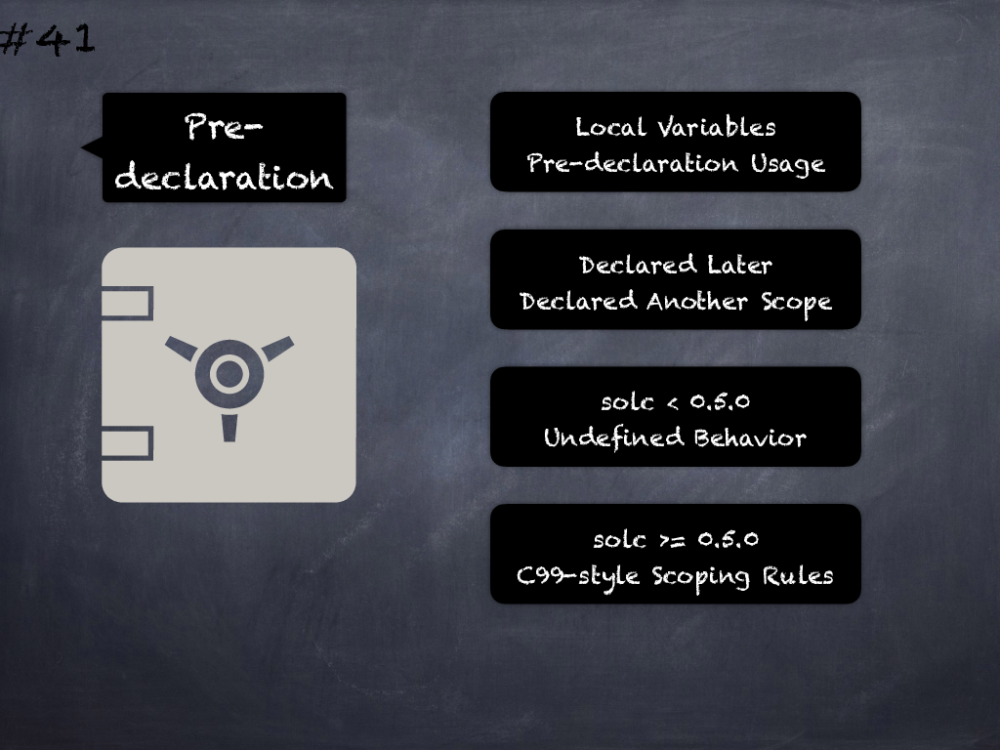

# 41 - [Pre-declaration usage of local variables](Pre-declaration%20usage%20of%20local%20variables.md)
Usage of a variable before its declaration (either declared later or in another scope) leads to unexpected behavior in _solc < 0.5.0_ but _solc >= 0.5.0_ implements C99-style scoping rules where variables can only be used after they have been declared and only in the same or nested scopes. (see [here](https://github.com/crytic/slither/wiki/Detector-Documentation#pre-declaration-usage-of-local-variables))

___
## Slide Screenshot

___
## Slide Text
- 
___
## References
- Youtube Reference
___
## Tags