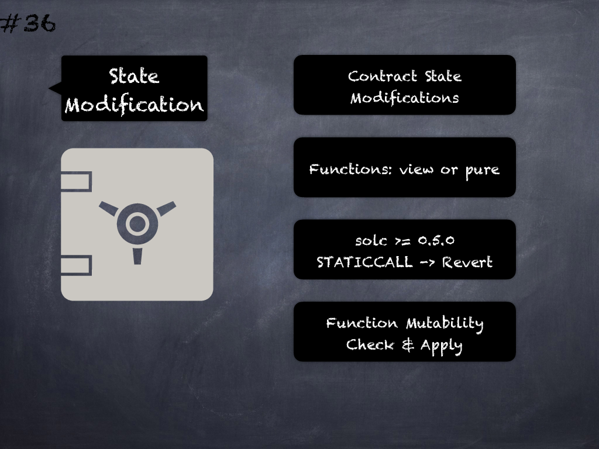

# 36 - [State-modifying functions](State-modifying%20functions.md)
Functions that modify state (in assembly or otherwise) but are labelled _constant_/_pure_/_view_ revert in _solc >=0.5.0_ (work in prior versions) because of the use of _STATICCALL_ opcode. (see [here](https://github.com/crytic/slither/wiki/Detector-Documentation#constant-functions-using-assembly-code))

___
## Slide Screenshot

___
## Slide Text
- 
___
## References
- Youtube Reference
___
## Tags