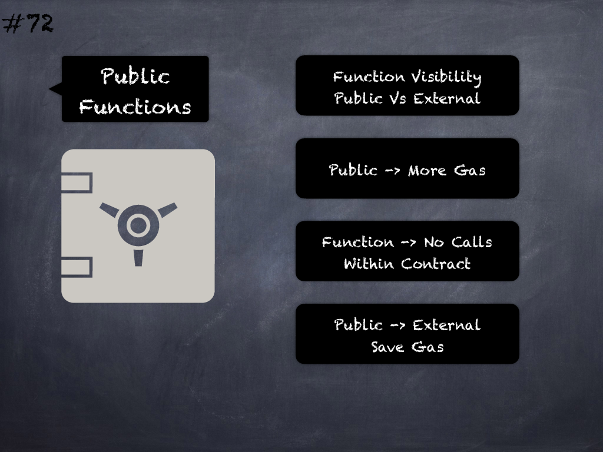

# 72 - [Uncalled public functions](Uncalled%20public%20functions.md)
_Public_ functions that are never called from within the contracts should be declared _external_ to save gas. (see [here](https://github.com/crytic/slither/wiki/Detector-Documentation#public-function-that-could-be-declared-external))

___
## Slide Screenshot

___
## Slide Text
- 
___
## References
- Youtube Reference
___
## Tags