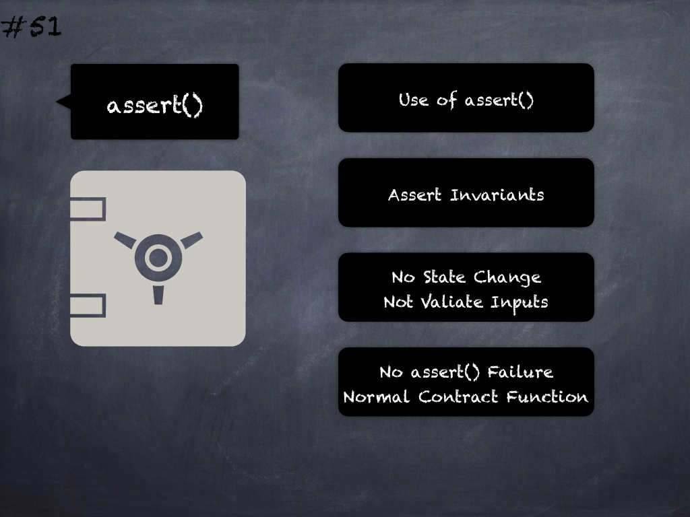

# 51 - [assert(), require() state change](assert(),%20require()%20state%20change.md)
Invariants in _assert()_ and _require()_ statements should not modify the state per best practices. (see [here](https://swcregistry.io/docs/SWC-110))

___
## Slide Screenshot

___
## Slide Text
- 
___
## References
- Youtube Reference
___
## Tags