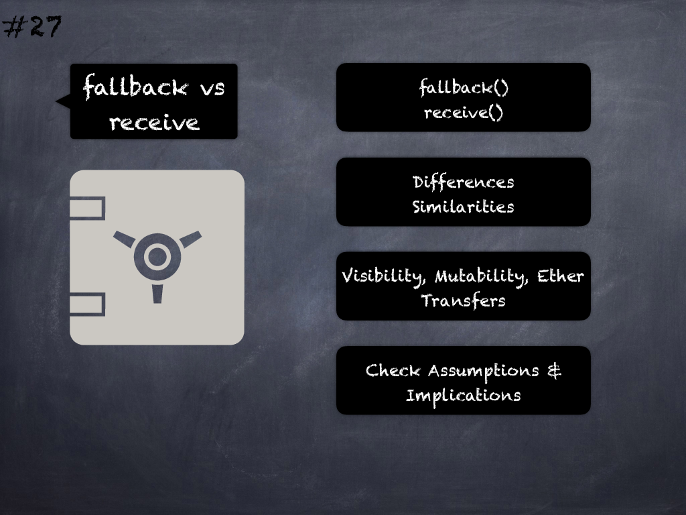

# 27 - [fallback vs receive()](fallback%20vs%20receive().md)
Check that all precautions and subtleties of _fallback_/_receive_ functions related to visibility, state mutability and Ether transfers have been considered.  (see [here](https://docs.soliditylang.org/en/latest/contracts.html#fallback-function) and [here](https://docs.soliditylang.org/en/latest/contracts.html#receive-ether-function))

___
## Slide Screenshot

___
## Slide Text
- 
___
## References
- Youtube Reference
___
## Tags