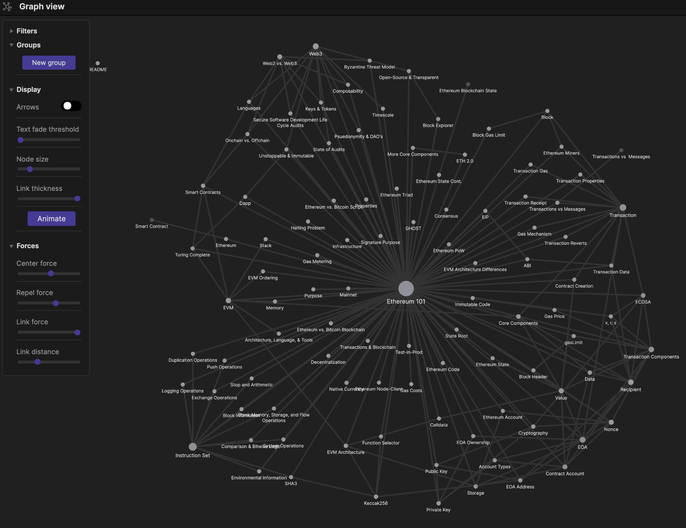

**All information was original created by** [0xRajeev](https://twitter.com/0xRajeev) that he has developed from other public sources. This content is based upon the Secureum Epoch0 Bootcamp for Smart Contract auditng.

The plan is to grow this over time. Pull requests accepted.
___
Sections/information I would like to add (my wish list): 
- [x] Screenshots of each slide for each topic.
- [ ] The time in the youtube video that the topic is discussed.
- [ ] Links to the relevant topic on youtube at that specific point in the video.
- [ ] Text to speech of what is said for each topic by Rajeev in the videos
- [ ] Solidity example where applicable
- [ ] Add dapptool examples for relevant sections.
___
The impetus for this project was for self-edification as well as enabling accessibility to the content [0xRajeev](https://twitter.com/0xRajeev) has produced. Also, I really just wanted to make some cool graphs and play with Obsidian. :)

Currently, I have copied over the slide text as well as the relavent section from the blog.

If you open this in [Obsidian](https://obsidian.md) you can graph the notes.

### Mindmap Content
1. [Ethereum101](1.Ethereum101.md)
2. [Solidity101](2.Solidity101.md)
___
## Week 1 - [Ethereum101](1.Ethereum101.md)

### Blog
[Article on "Ethereum 101"](https://secureum.substack.com/p/ethereum-101)

### Youtube Videos
YouTube videos on "Ethereum 101":
1.  [Block 1](https://youtu.be/44qhIBMGMoM)

2.  [Block 2](https://youtu.be/zIeBfuXxuWs)

3.  [Block 3](https://youtu.be/ltvTIr4K63s)

4.  [Block 4](https://youtu.be/MFoxW07ICKs)

5.  [Block 5](https://youtu.be/I-TjCtjDs1M)

### Assignment
1.  Read the Ethereum whitepaper: [https://ethereum.org/en/whitepaper/](https://ethereum.org/en/whitepaper/)
2.  Read the Ethereum yellow paper: [https://ethereum.github.io/yellowpaper/paper.pdf](https://ethereum.github.io/yellowpaper/paper.pdf)
3.  Read Chapters 1, 2, 3, 4, 6, 13 and 14 from “Mastering Ethereum”: [https://github.com/ethereumbook/ethereumbook](https://github.com/ethereumbook/ethereumbook) and other references in Secureum’s “Ethereum 101” article
4.  Browse through topics at [https://ethereum.org/en/developers/docs/](https://ethereum.org/en/developers/docs/)
5.  Explore blocks, transactions and other protocol internals at [https://etherscan.io/](https://etherscan.io/)

___
## Week 2 - [Solidity101](2.Solidity101.md)
### Blog
[Article on "Solidity 101"](https://secureum.substack.com/p/solidity-101)
### Youtube Videos
1.  [Block 1](https://www.youtube.com/watch?v=5eLqFac5Tkg)
2.  [Block 2](https://www.youtube.com/watch?v=TCl1IcGl_3I)
3.  [Block 3](https://www.youtube.com/watch?v=6VIJpze1jbU)
4.  [Block 4](https://www.youtube.com/watch?v=WgU7KKKomMk)
5.  [Block 5](https://www.youtube.com/watch?v=_oN7XuyhoZA)
### Assignment
1.  Read Chapter 7 from “Mastering Ethereum”: [https://github.com/ethereumbook/ethereumbook/blob/develop/07smart-contracts-solidity.asciidoc](https://github.com/ethereumbook/ethereumbook/blob/develop/07smart-contracts-solidity.asciidoc)
2.  Understand Solidity syntax and semantics implemented in OpenZeppelin’s ERC20 contract: [https://github.com/OpenZeppelin/openzeppelin-contracts/blob/master/contracts/token/ERC20/ERC20.sol](https://github.com/OpenZeppelin/openzeppelin-contracts/blob/master/contracts/token/ERC20/ERC20.sol)
3.  Understand Solidity syntax and semantics implemented in OpenZeppelin’s ERC721 (NFT) contract: [https://github.com/OpenZeppelin/openzeppelin-contracts/blob/master/contracts/token/ERC721/ERC721.sol](https://github.com/OpenZeppelin/openzeppelin-contracts/blob/master/contracts/token/ERC721/ERC721.sol)
4.  Understand Solidity syntax and semantics implemented in OpenZeppelin’s security-related contracts Ownable, Pausable and ReentrancyGuard: [https://github.com/OpenZeppelin/openzeppelin-contracts/tree/master/contracts/access](https://github.com/OpenZeppelin/openzeppelin-contracts/tree/master/contracts/access) and [https://github.com/OpenZeppelin/openzeppelin-contracts/tree/master/contracts/security](https://github.com/OpenZeppelin/openzeppelin-contracts/tree/master/contracts/security)
5.  Experiment with the various Solidity concepts using [https://remix.ethereum.org/](https://remix.ethereum.org/)
___
## Week 3
### Blog
### Youtube Videos
### Assignment
___
## Week 4
### Blog
### Youtube Videos
### Assignment
___
## Week 5
### Blog
### Youtube Videos
### Assignment
___
## Week 6
### Blog
### Youtube Videos
### Assignment
___
## Week 7
### Blog
### Youtube Videos
### Assignment
___
## Week 8
### Blog
### Youtube Videos
### Assignment
	
## Program Information
**Details**: [https://secureum.substack.com/p/secureum-bootcamp-for-smart-contract](https://secureum.substack.com/p/secureum-bootcamp-for-smart-contract)  
**Funded by**: Ethereum Foundation Grant  
**Sponsor Partners**: [ConsenSys Diligence](https://consensys.net/diligence/), [Sigma Prime](https://sigmaprime.io/), [Trail of Bits](https://www.trailofbits.com/)