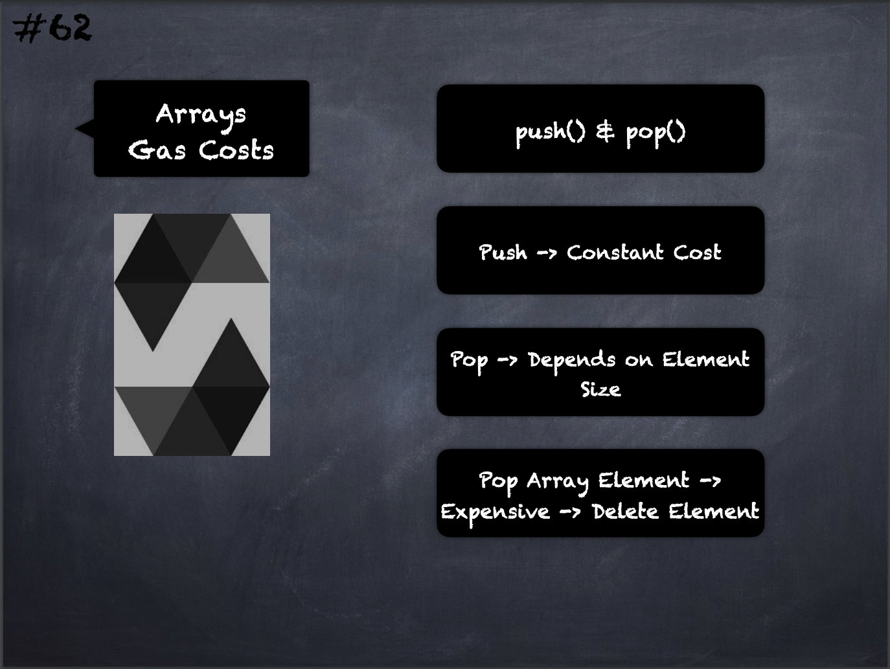

# 62 - [Arrays - Gas Costs](Arrays%20-%20Gas%20Costs.md)
[Gas Costs](../Ethereum101/Gas%20Costs.md) of `push` and `pop`: Increasing the length of a storage array by calling `push()` has constant gas costs because [storage](../Ethereum101/Storage.md) is zero-initialised, while decreasing the length by calling `pop()` has a cost that depends on the “size” of the element being removed. 

If that element is an array, it can be very costly, because it includes explicitly clearing the removed elements similar to calling delete on them.

___
## Slide Screenshot

___
## Slide Deck
- `push()` & `pop()`
- Push -> Constant Cost
- Pop -> Depends on Element Size
- Pop Array Element -> Expensive -> Delete Element
___
## References
- [Youtube Reference](https://youtu.be/WgU7KKKomMk?t=69)

