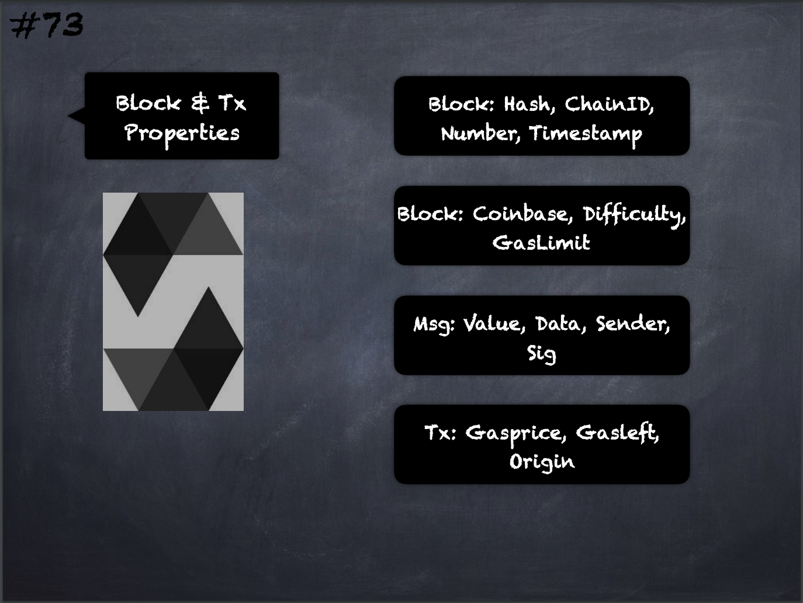

# 73 - [Block & Transaction Properties](Block%20&%20Transaction%20Properties.md)
Block and Transaction Properties:

1.  `blockhash(uint blockNumber)` returns `(bytes32)`: hash of the given [block](../Ethereum101/Block.md) - only works for 256 most recent, excluding current, blocks
    
2.  `block.chainid (uint)`: current chain id
    
3.  `block.coinbase (address payable)`: current block miner’s address
    
4.  `block.difficulty (uint)`: current block difficulty
    
5.  `block.gaslimit (uint)`: current block [gasLimit](../Ethereum101/gasLimit.md)
    
6.  `block.number (uint)`: current block number
    
7.  `block.timestamp (uint)`: current block timestamp as seconds since unix epoch
    
8.  `msg.data (bytes calldata)`: complete calldata
    
9.  `msg.sender (address)`: sender of the message (current call)
    
10.  `msg.sig (bytes4)`: first four bytes of the calldata (i.e. function identifier)
    
11.  `msg.value (uint)`: number of wei sent with the message
    
12.  `tx.gasprice (uint)`: gas price of the transaction
    
13.  `gasleft() returns (uint256)`: remaining gas
    
14.  `tx.origin (address)`: sender of the transaction (full call chain)

___
## Slide Screenshot

___
## Slide Deck
- Block: Hash, ChainID, Number, Timestamp
- Block: Coinbase, Difficulty, [GasLimit](../Ethereum101/gasLimit.md)
- Msg: [Value](../Ethereum101/Value.md), [Data](../Ethereum101/Data.md), Sender, Sig
- Tx: Gasprice, Gasleft, Origin
___
## References
- [Youtube Reference](https://youtu.be/WgU7KKKomMk?t=1111)

___
## Resources
- 
