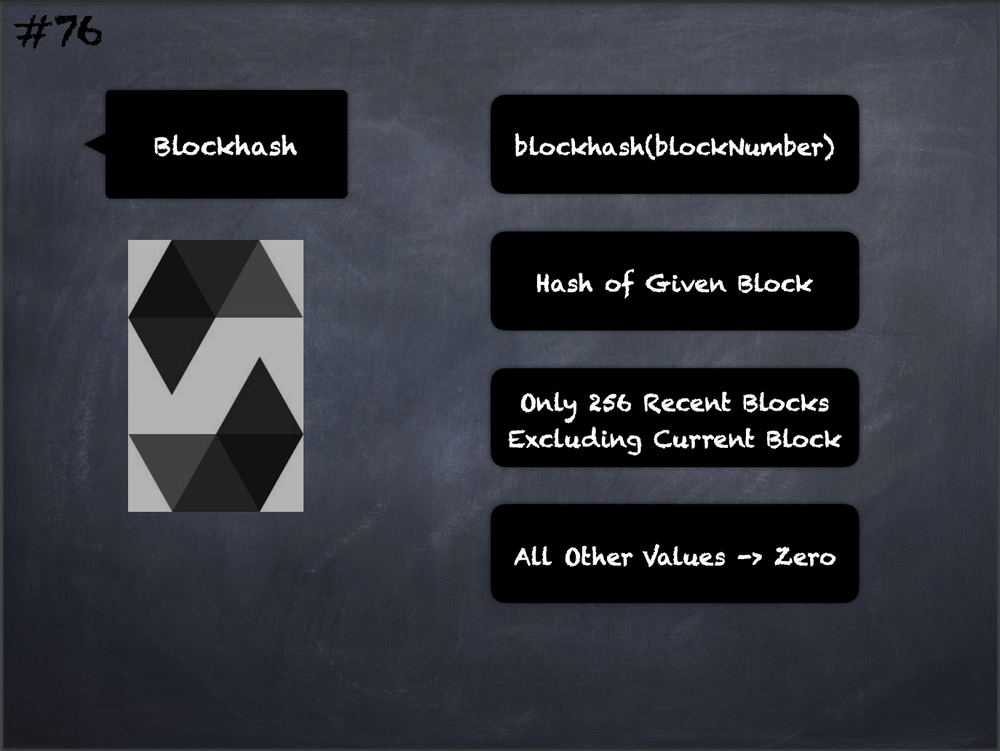

# 76 - [Blockhash](Blockhash.md)
The block hashes are not available for all blocks for scalability reasons. You can only access the hashes of the most recent 256 blocks, all other values will be zero.
___
## Slide Screenshot

___
## Slide Deck
- blockhash(blockNumber)
- Hash of Given Block
- Only 256 Recent Blocks Excluding Current Block
- All Other Values -> Zero
___
## References
- [Youtube Reference](https://youtu.be/WgU7KKKomMk?t=1338)

___
## Resources
- 
