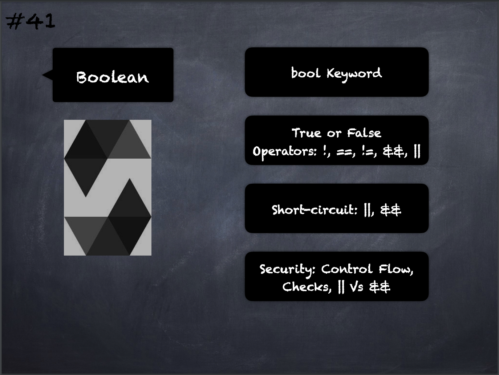

# 41 - [Boolean](Boolean.md)
`bool` Keyword and the possible values are constants true and false. 

1.  Operators are:
	- `!` (logical negation) 
	- `&&` (logical conjunction “and”) 
	- `||` (logical disjunction, “or”)
	- `==` (equality) 
	- `!=` (inequality). 
    
2.  The operators `||` and `&&` apply the common short-circuiting rules. This means that in the expression `f(x) || g(y)`, if `f(x)` evaluates to true, `g(y)` will not be evaluated even if it may have side-effects.

___
## Slide Screenshot

___
## Slide Deck
- `bool` Keyword
- True or False
- Operators: `!`, `==`, `!=`, `&&`, `||`
- Short-circuit: `||`, `&&`
- Security: Control Flow & Checks, `||` vs. `&&`
___
## References
- [Youtube Reference](https://www.youtube.com/watch?v=6VIJpze1jbU)

