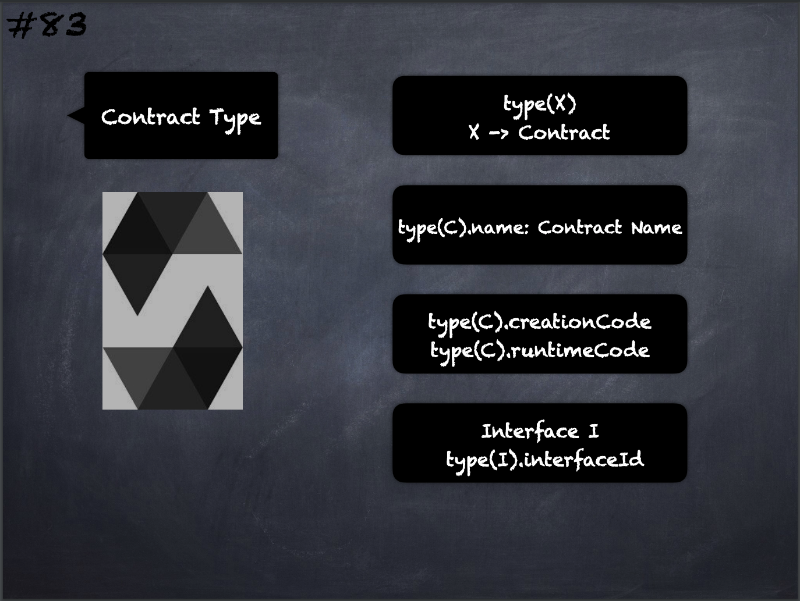

# 83 - [Contract Type Continued](Contract%20Type%20Cont..md)
Every contract defines its own type. Contracts can be explicitly converted to and from the `address` type. Contract types do not support any operators. The members of contract types are the `external` functions of the contract including any state variables marked as public.

___
## Slide Screenshot

___
## Slide Deck
- `type(X)`
- X -> Contract
- `type(C).name` -> Contract Name
- `type(C).creationCode`
- `type(C).runtimeCode`
___
## References
- [Youtube Reference](https://youtu.be/_oN7XuyhoZA?t=163)

___
## Resources
- 
