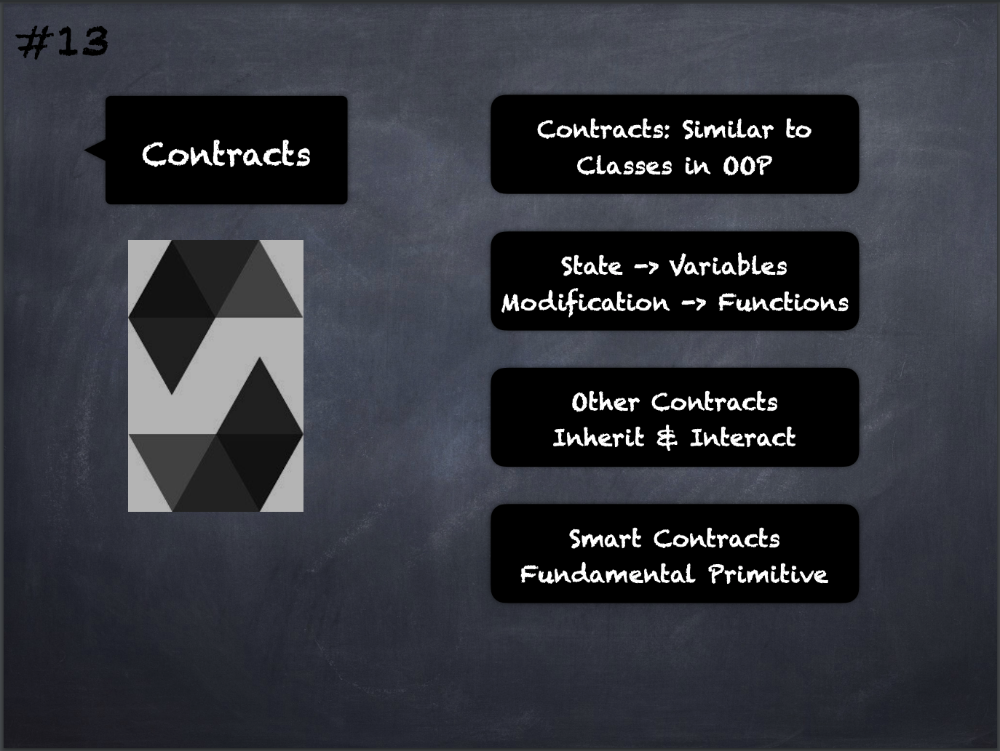

# 13 - [Contracts](Contracts.md)
They are similar to classes in object-oriented languages in that they contain persistent data in state variables and functions that can modify these variables. Contracts can inherit from other contracts

___
## Slide Screenshot

___
## Slide Deck
- Contracts: Similar to Classes in OOP
- [State](Ethereum%20State.md) -> [State Variables](State%20Variables.md)
- Modifications -> [Functions](Functions.md)
- Other Contracts
	- Inherit & Interact
- [Smart Contracts](Smart%20Contracts.md) -> Fundamental Primitive
___
## References
- [Youtube Reference](https://youtu.be/5eLqFac5Tkg?t=1425)
___
## Resources

## Tags
[Contract Continued](Contract%20Continued.md)