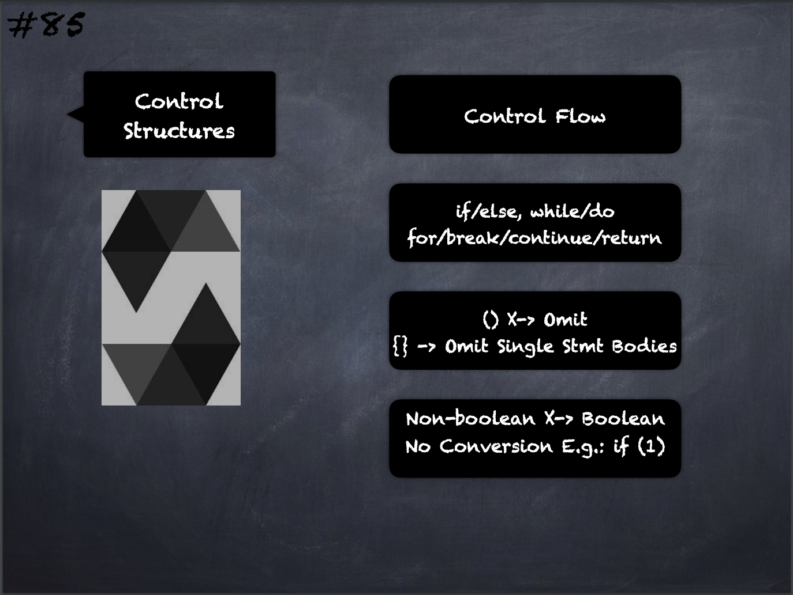

# 85 - [Control Structures](Control%20Structures.md)
[Solidity](Solidity.md) has `if`, `else`, `while`, `do`, `for`, `break`, `continue`, `return`, with the usual semantics known from C or JavaScript

1. Parentheses can not be omitted for conditionals, but curly braces can be omitted around single-statement bodies
    
2. Note that there is no type conversion from non-boolean to boolean types as there is in C and JavaScript, so `if (1) { ... }` is not valid Solidity.

___
## Slide Screenshot

___
## Slide Deck
- Control Flow
- `if`/`else`, `while`/`do`
- `for`/`break`/`continue`/`return`
- `() X` -> Omit
- `{}` -> Omit Single Statement Bodies
- Non-Boolean X -> Boolean
- No Conversion E.g.: `if (1)`
___
## References
- [Youtube Reference](https://youtu.be/_oN7XuyhoZA?t=278)

