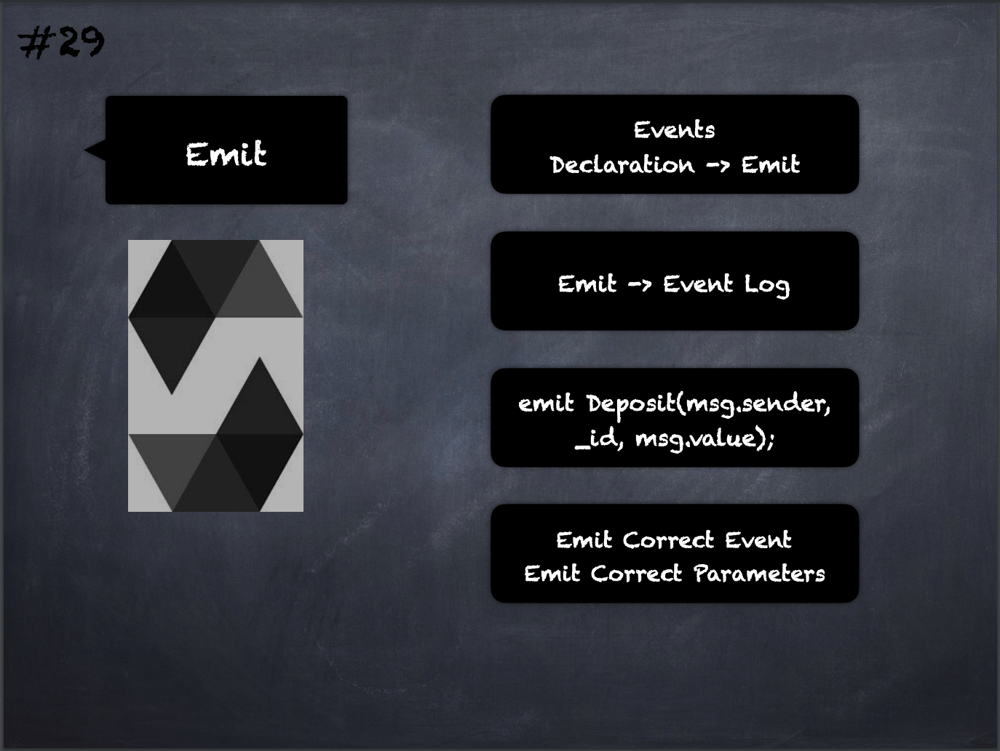

# 29 - [Emit](Emit.md)
[Events](Events.md) are emitted using `emit`, followed by the name of the event and the arguments e.g. `emit Deposit(msg.sender, _id, msg.value);`

___
## Slide Screenshot

___
## Slide Deck
- Events Declaraction -> Emit
- Emit -> Event Log
- `emit Deposit(msg.sender, _id, msg.value);`
- Emit Correct Event
- Emit Correct Parameters
___
## References
- [Youtube Reference](https://youtu.be/TCl1IcGl_3I?t=693)

