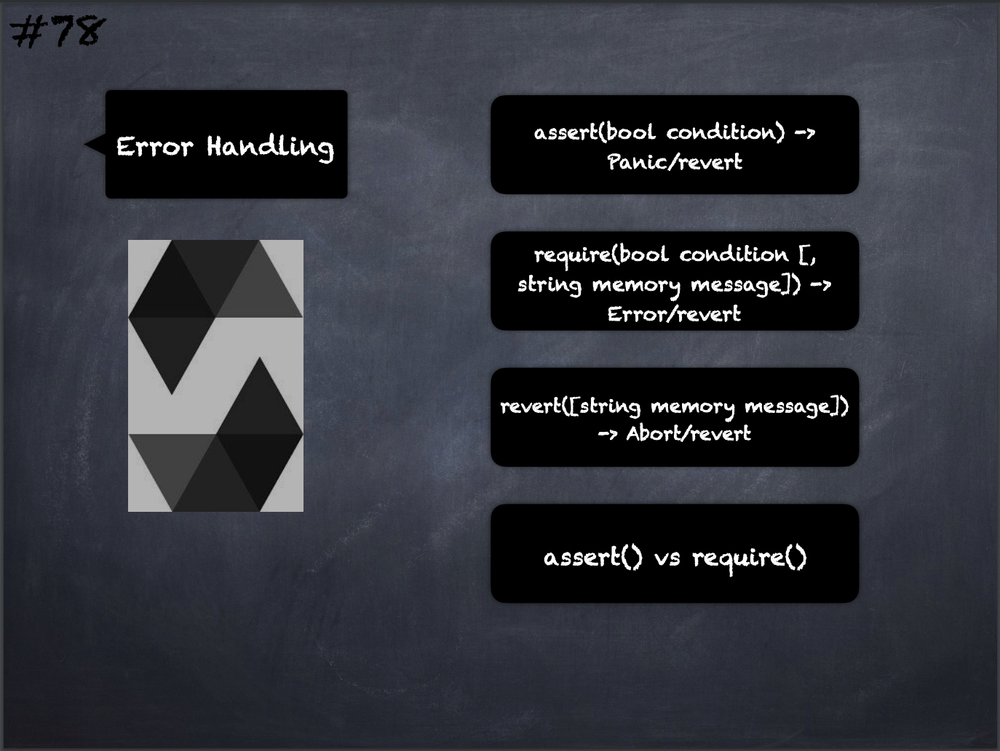

# 78 - [Error Handling](Error%20Handling.md)
Error Handling:

1. `assert(bool condition)`: causes a Panic error and thus state change reversion if the condition is not met - to be used for internal errors.
    
2. `require(bool condition)`: reverts if the condition is not met - to be used for errors in inputs or external components.
    
3. `require(bool condition, string memory message)`: reverts if the condition is not met - to be used for errors in inputs or external components. Also provides an error message.
    
4. `revert()`: abort execution and revert state changes
    
5. `revert(string memory reason)`: abort execution and revert state changes, providing an explanatory string

___
## Slide Screenshot

___
## Slide Deck
- `assert(bool condition)` -> Panic/revert
- `require(bool condition [, string memory message])` -> Error, revert
- `assert()` vs `require()`
___
## References
- [Youtube Reference](https://youtu.be/WgU7KKKomMk?t=1446)

