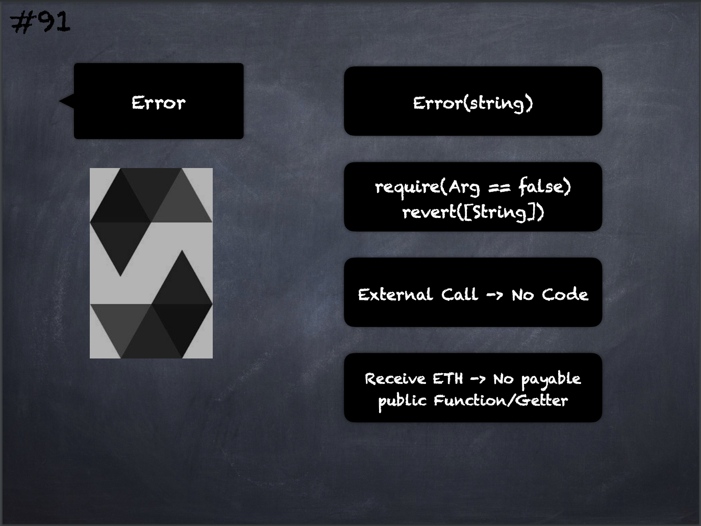

# 91 - [Errors](Errors.md)
A `Error(string)` exception (or an exception without [data](Data.md)) is generated in the following situations:

1.  Calling `require` with an argument that evaluates to false.
    
2.  If you perform an external function call targeting a contract that contains no code
    
3.  If your contract receives Ether via a public function without payable modifier (including the [Constructor](Constructor.md) and the [Fallback function](Fallback%20Function.md))
    
4.  If your contract receives Ether via a public getter function

___
## Slide Screenshot

___
## Slide Deck
- `Error(string)`
- `require(Arg == false)`
- `revert([String])`
- Receive ETH -> No payable public Function/Getter
___
## References
- [Youtube Reference](https://youtu.be/_oN7XuyhoZA?t=924)

___
## Resources
- 
