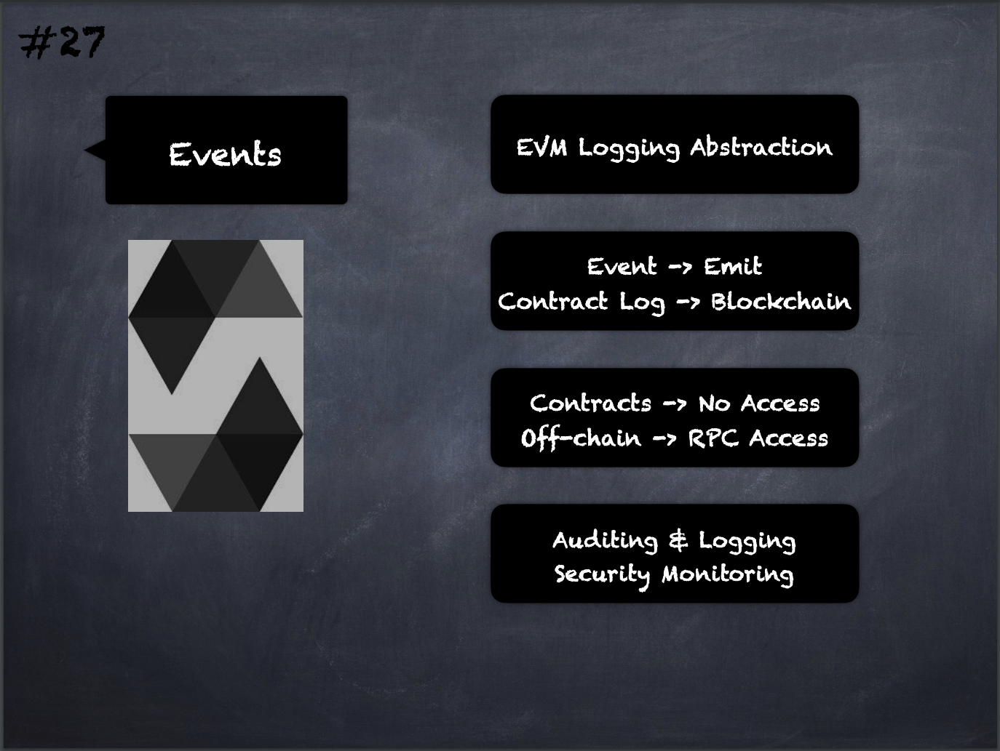

# 27 - [Events](Events.md)
They are an abstraction on top of the [EVM](../Ethereum101/EVM.md)’s logging functionality. [Emitting](Emit.md) events cause the arguments to be stored in the transaction’s log - a special data structure in the blockchain. 

These logs are associated with the address of the contract, are incorporated into the blockchain, and stay there as long as a block is accessible. 

The Log and its event data is not accessible from within contracts (not even from the contract that created them). 

Applications can subscribe and listen to these events through the RPC interface of an Ethereum client.

___
## Slide Screenshot

___
## Slide Deck
- [EVM](EVM.md) Logging Abstraction
- Event -> Emit
- Contract Log -> Blockchain
- Contracts -> No Access
- Off-chain -> RPC Access
- Auditing & Logging
- Security Monitoring
___
## References
- [Youtube Reference](https://youtu.be/TCl1IcGl_3I?t=533)

