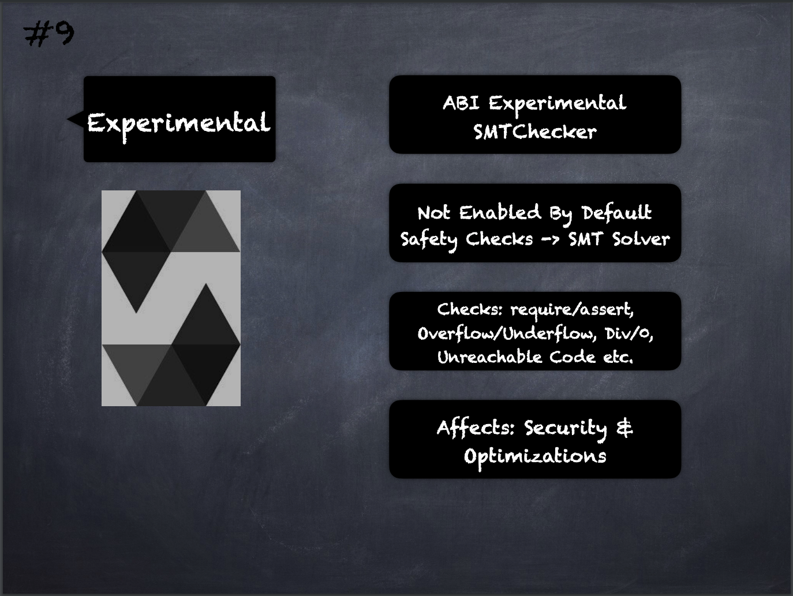

# 9 - [Experimental](Experimental.md)
Experimental Pragma: This can be used to enable features of the compiler or language that are not yet enabled by default

1.  SMTChecker: The use of “_pragma experimental SMTChecker;”_ performs additional safety checks which are obtained by querying an SMT solver (See [SMTChecker](https://docs.soliditylang.org/en/v0.8.9/smtchecker.html#formal-verification))
    
2.  The SMTChecker module automatically tries to prove that the code satisfies the specification given by require and assert statements. That is, it considers require statements as assumptions and tries to prove that the conditions inside assert statements are always true. If an assertion failure is found, a counterexample may be given to the user showing how the assertion can be violated. If no warning is given by the SMTChecker for a property, it means that the property is safe.
    
3.  Other checks: Arithmetic underflow and overflow, Division by zero, Trivial conditions and unreachable code, Popping an empty array, Out of bounds index access, Insufficient funds for a transfer.

___
## Slide Screenshot

___
## Slide Deck
- ABI Experimental
	- SMT Checker
- Not Enabled By Default
- Safety Checks -> SMT Solvers
- Checks: 
	- require/assert
	- Overflows/Underflow
	- Divide by zero
	- Unreachable Code 
	- etc.
- Affects Security & Optimizations
___
## References
- [Youtube Reference](https://youtu.be/5eLqFac5Tkg?t=967)

___
## Resources
- 
