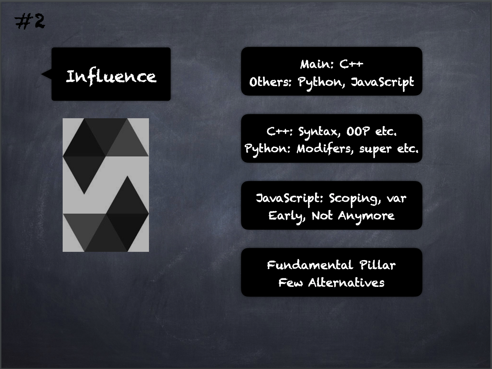

# 2 - [Influence](Influence.md)
It is influenced mainly by C++, a little from Python and early-on from JavaScript. 

The syntax and OOP concepts are from C++.

Solidity’s modifiers, multiple inheritance, C3 linearization and the super keyword are influences from Python. 

Function-level scoping and var keyword were JavaScript influences early-on but those have been reduced since v0.4.0.

___
## Slide Screenshot

___
## Slide Deck
- Main: C++
- Others: Python, JavaScript
- C++: Syntax, OOP, etc.
- Python: Modifiers, super, etc.
- JavaScript: Scoping, var Early, Not Anymore
- Fundamental Pillar
- Few Alternatives
___
## References
- [Youtube Reference](https://youtu.be/5eLqFac5Tkg?t=143)
- [SolidityLang.org - Language Influences](https://docs.soliditylang.org/en/v0.8.9/language-influences.html)

___
## Resources
- 
