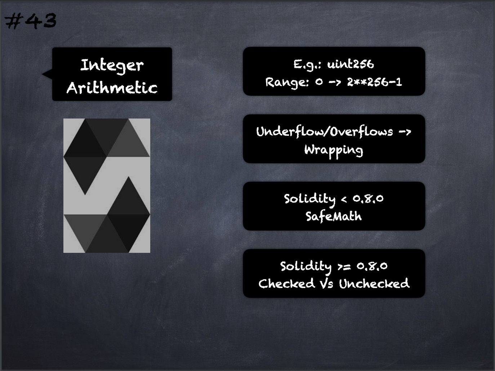

# 43 - [Integer Arthimetic](Integer%20Arthimetic.md)
Integers in Solidity are restricted to a certain range. For example, with `uint32`, this is 0 up to `2**32 - 1`. There are two modes in which arithmetic is performed on these types: The “wrapping” or “unchecked” mode and the “checked” mode. By default, arithmetic is always “checked”, which means that if the result of an operation falls outside the value range of the type, the call is reverted through a failing assertion. You can switch to “unchecked” mode using unchecked { ... }. This was introduced in compiler version 0.8.0.
___
## Slide Screenshot

___
## Slide Deck
- E.g.: `uint256`
	- Range: 0 -> `2**256-1`
- Underflow/Overflows -> Wrapping
- Solidity < 0.8.0 -> SafeMath
- Solidity >= 0.8.0 -> Built-in
- Checked vs. Unchecked
___
## References
- [Youtube Reference](https://youtu.be/6VIJpze1jbU?t=278)

