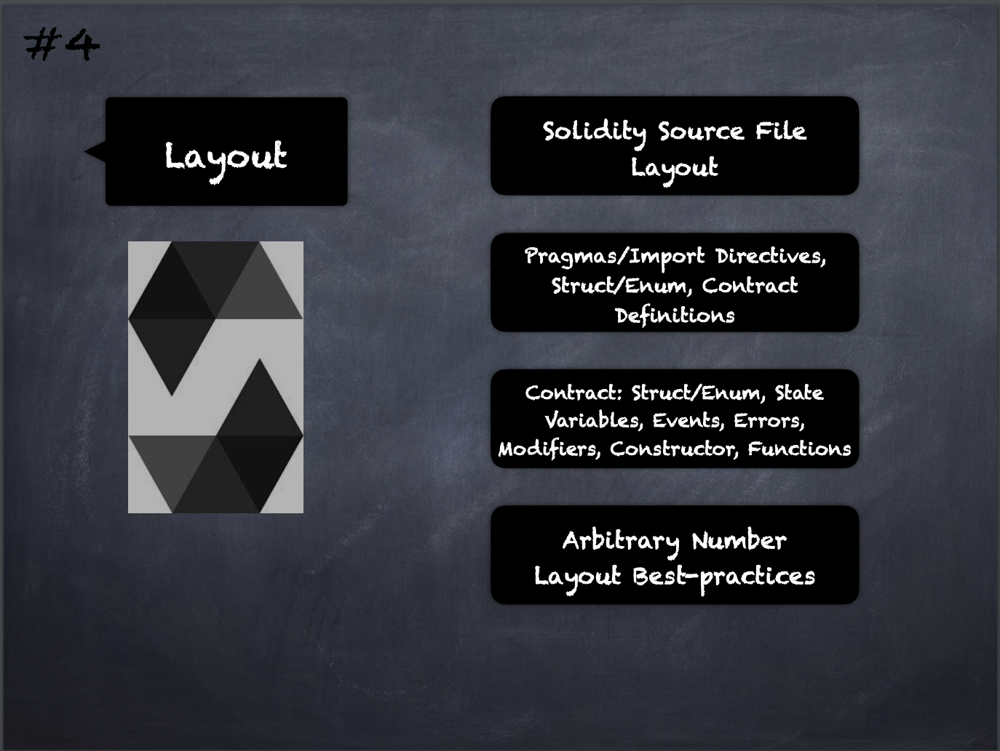

# 4 - [Layout](Layout.md)
The layout of a Solidity source file can contain an arbitrary number of pragma directives, import directives and struct/enum/contract definitions. 

The best-practices for layout within a contract is the following order: 
1. state variables
2. events
3. modifiers
4. constructor
5. functions

___
## Slide Screenshot

___
## Slide Deck
- Solidity Source File Layout
	- Pragmas/Import Directives
	- Struct/Enum
	- Contract Definitions
- Contract: 
	- Strut/Enum
	- State Variables
	- Events
	- Errors
	- Modifiers
	- Contructor
	- Functions
- Arbitrary Number
- Layout Best-practices

___
## References
- [Youtube Reference](https://youtu.be/5eLqFac5Tkg?t=346)

___
## Resources
- 
