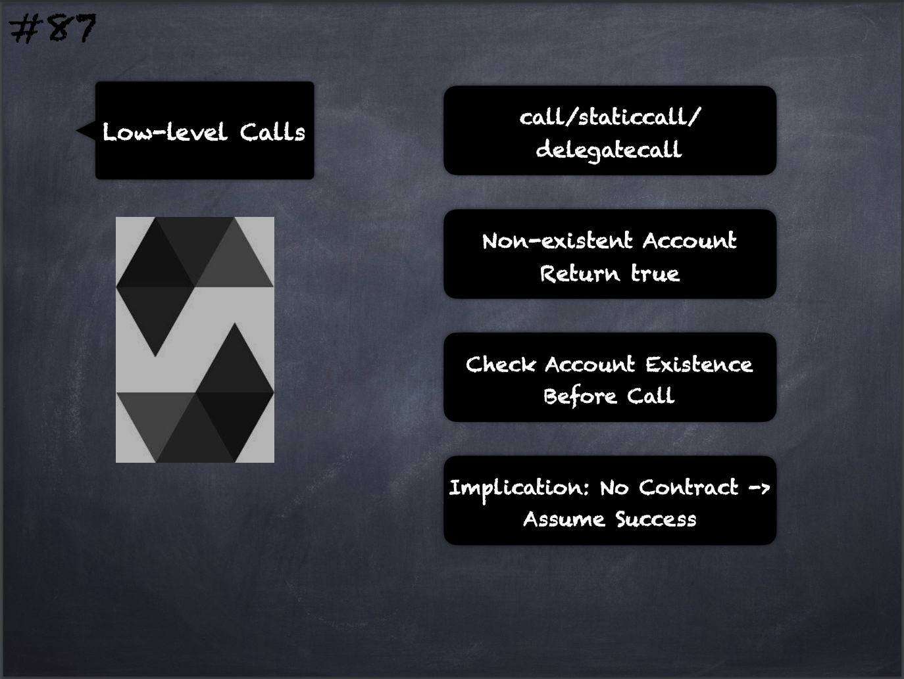

# 87 - [Low-level Calls](Low-level%20Calls.md)
The low-level functions `call`, `delegatecall` and `staticcall` return true as their first return value if the account called is non-existent, as part of the design of the EVM. Account existence must be checked prior to calling if needed.

___
## Slide Screenshot

___
## Slide Deck
- `call`/`staticcall`/`delegatecall`
- Non-existent Account -> Return True
- Check Account Existence Before Call
- Implication: No Contract -> Assume Success
___
## References
- [Youtube Reference](https://youtu.be/_oN7XuyhoZA?t=598)
___
## Tags
[System Operations](../Ethereum101/System%20Operations.md)

