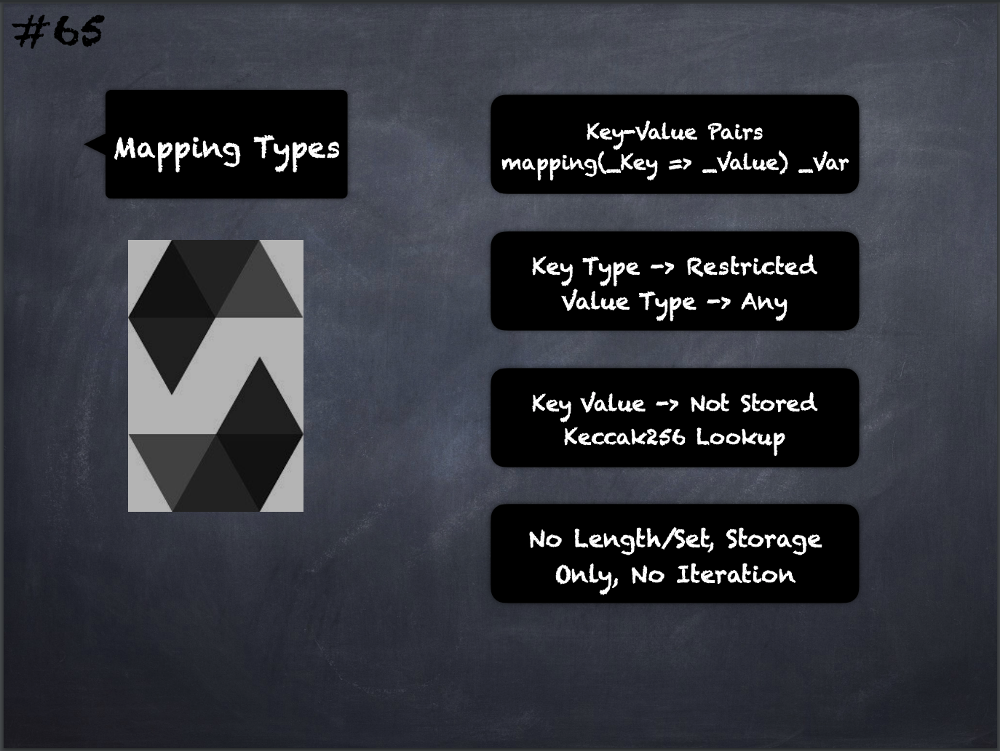

# 65 - [Mapping Types](Mapping%20Types.md)
Mappings define key-value pairs and are declared using the syntax `mapping(KeyType => ValueType) VariableName.` 

1. The **KeyType** can be any built-in value type, `bytes`, `string`, or any `contract` or `enum` type. Other user-defined or complex types, such as `mappings`, `structs` or `array` types are not allowed. **ValueType** can be any type, including `mappings`, `arrays` and `structs`.
    
2. Key data is not stored in a mapping, only its [keccak256](Keccak256.md) hash is used to look up the value
    
3. They do not have a length or a concept of a key or value being set
    
4. They can only have a [data location](Data%20Location.md) of [storage](../Ethereum101/Storage.md) and thus are allowed for state variables, as storage reference types in functions, or as parameters for library functions
    
5. They cannot be used as parameters or return parameters of contract functions that are publicly visible. These restrictions are also true for arrays and structs that contain mappings.
    
6. You cannot iterate over mappings, i.e. you cannot enumerate their keys. It is possible, though, to implement a data structure on top of them and iterate over that.

___
## Slide Screenshot

___
## Slide Deck
- Key-Value Pairs
- <nobr>`mapping(KeyType => ValueType) VariableName.`</nobr> 
- Key Type -> Restricted
- Value Type -> Any
- Key Value -> Not Stored
- Keccak256 Lookup
- No Length/Set, Storage Only, No Iteration
___
## References
- [Youtube Reference](https://youtu.be/WgU7KKKomMk?t=279)

