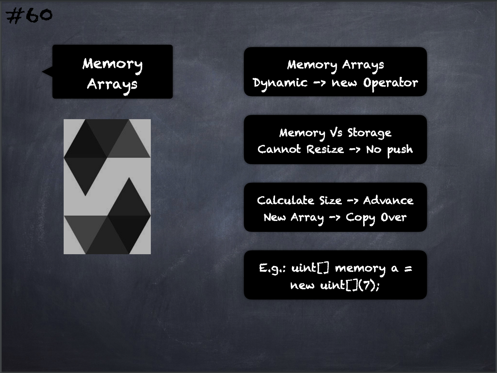

# 60 - [Memory Arrays](Memory%20Arrays.md)
Memory arrays with dynamic length can be created using the `new` operator

1.  As opposed to storage arrays, it is not possible to resize memory arrays i.e. the `.push` member functions are not available
    
2.  You either have to calculate the required size in advance or create a new memory array and copy every element

___
## Slide Screenshot

___
## Slide Deck
- Memory Arrays
- Dynamic -> No Operator
- Memory & Storage
- Cannot Resize -> No push
- Calculate Size -> Advance
- New Array -> Copy Over
- E.g.: `uint[] memory a = new uint;`
___
## References
- [Youtube Reference](https://youtu.be/6VIJpze1jbU?t=2257)

___
## Resources
- 
