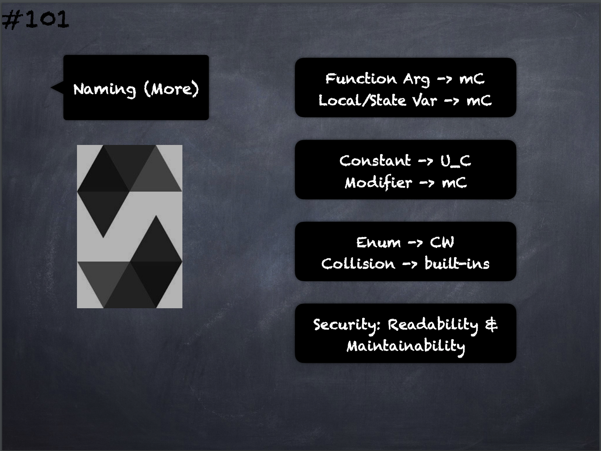

# 101 - [Naming Conventions Continued](Naming%20Conventions%20Continued.md)
1. [Function](Functions.md) arguments should use mixedCase. Examples: `initialSupply`, `account`, `recipientAddress`, `senderAddress`, `newOwner`.
    
2. Local and [state variables](State%20Variables.md) names should use mixedCase. Examples: `totalSupply`, `remainingSupply`, `balancesOf`, `creatorAddress`, `isPreSale`, `tokenExchangeRate`.
    
3. Constants should be named with all capital letters with underscores separating words. Examples: `MAX_BLOCKS`, `TOKEN_NAME`, `TOKEN_TICKER`, `CONTRACT_VERSION`.
    
4. [Modifier](Modifiers.md) names should use mixedCase. Examples: `onlyBy`, `onlyAfter`, `onlyDuringThePreSale`.
    
5. [Enums](Enums.md), in the style of simple type declarations, should be named using the CapWords style. Examples: `TokenGroup`, `Frame`, `HashStyle`, `CharacterLocation`.
    
6. Avoiding Naming Collisions: `single_trailing_underscore_`. This convention is suggested when the desired name collides with that of a built-in or otherwise reserved name.

___
## Slide Screenshot

___
## Slide Deck
- Function Arg -> mC
- Local/State Var -> mC
- Constant -> U_C
- Modifier -> mC
- Enum -> CW
- Collision -> built-in
- Security: Readability & Maintainability
___
## References
- [Youtube Reference](https://youtu.be/_oN7XuyhoZA?t=1808)

