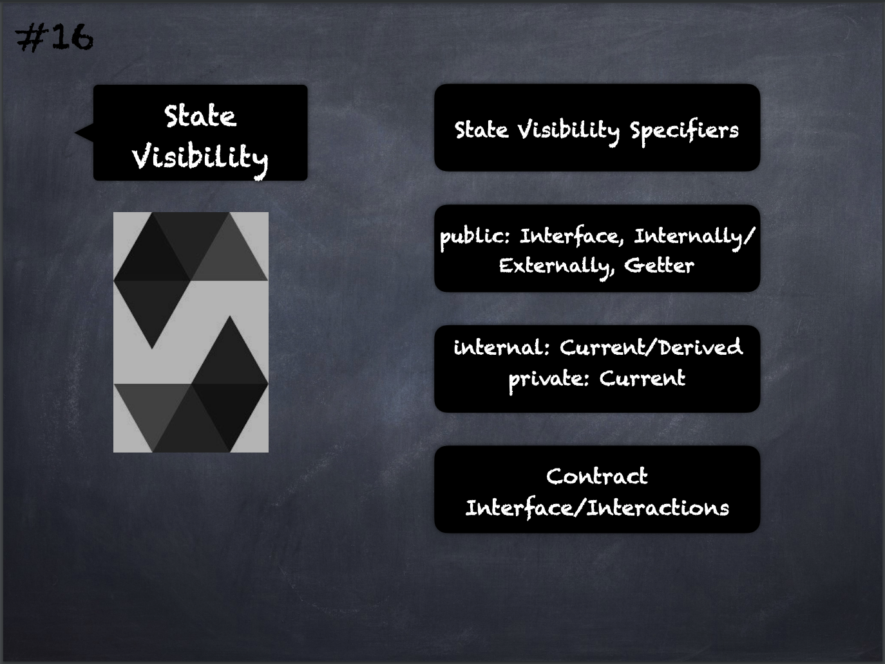

# 16 - [State Visibility Specifiers](State%20Visibility.md)
State variables have to be specified as being public, internal or private:

1.  `public`: Public state variables are part of the contract interface and can be either accessed internally or via messages. An automatic getter function is generated.
    
2.  `internal`: Internal state variables can only be accessed internally from within the current contract or contracts deriving from it
    
3.  `private`: Private state variables can only be accessed from the contract they are defined in and not even in derived contracts. Everything that is inside a contract is visible to all observers external to the blockchain. Making variables private only prevents other contracts from reading or modifying the information, but it will still be visible to the whole world outside of the blockchain.

___
## Slide Screenshot

___
## Slide Deck
- State Visibility Specifiers
- Public: 
	- Interface
	- Internally/Externally
	- Getter
- Internal: Current/Derived
- Private: Current
- Contract
- Interface/Interactions
___
## References
- [Youtube Reference](https://youtu.be/5eLqFac5Tkg?t=1582)

