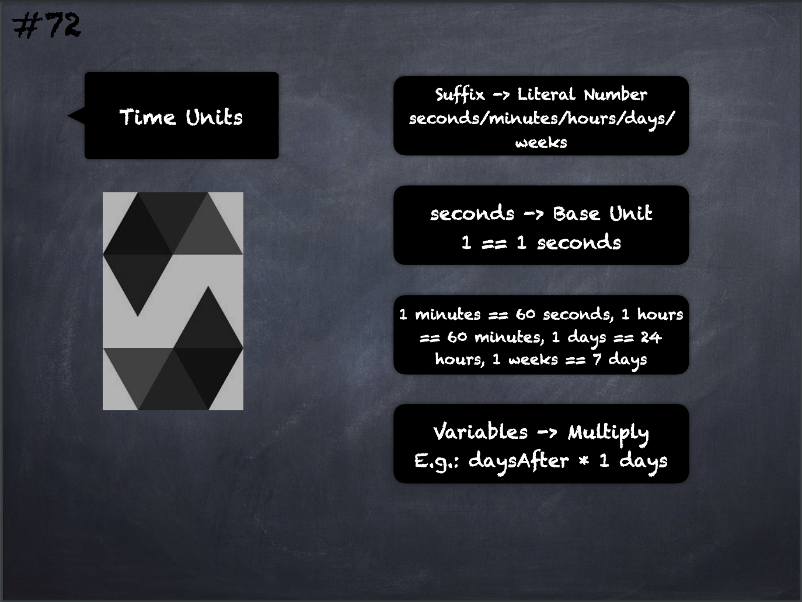

# 72 - [Time Units](Time%20Units.md)
Suffixes like seconds, minutes, hours, days and weeks after literal numbers can be used to specify units of time where seconds are the base unit where `1 == 1 seconds`, `1 minutes == 60 seconds`, `1 hours == 60 minutes`, `1 days == 24 hour`s and `1 weeks == 7 days`

1.  Take care if you perform calendar calculations using these units, because not every year equals 365 days and not even every day has 24 hours because of leap seconds
    
2.  These suffixes cannot be applied directly to variables but can be applied by multiplication

___
## Slide Screenshot

___
## Slide Deck
- Suffix -> Literal Number: seconds/minutes/hours/days/weeks
- seconds -> Base Unit
- `1 == 1 seconds`
- `1 minutes == 60 seconds`, `1 hours == 60 minutes` `1 days == 24 hours`, `1 weeks == 7 days`
- Variables -> Multiply
	- E.g.: `daysAFter * 1 days`
___
## References
- [Youtube Reference](https://youtu.be/WgU7KKKomMk?t=1018)

