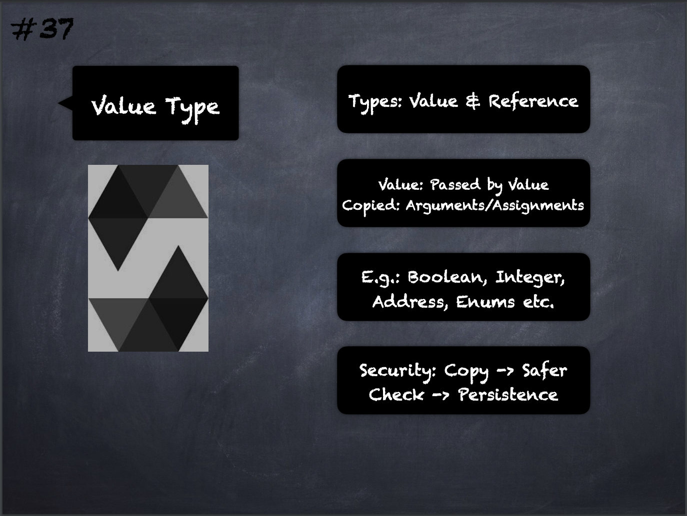

# 37 - [Value Type](Value%20Type.md)
Types that are passed by value, i.e. they are always copied when they are used as function arguments or in assignments: 
- [Booleans](Boolean.md)
- [Integers](Integers.md)
- [Fixed Point](Fixed%20Point.md) Numbers
- [Address Type](Address%20Type.md)
- [Contract](Contract.md)
- Fixed-size [Bytes Arrays](Bytes%20Arrays.md) (bytes1, bytes2, …, bytes32)
- Literals:
	- Address
	- Rational
	- Integer
	- String
	- Unicode
	- Hexadecimal
- Enums
- Functions.

___
## Slide Screenshot

___
## Slide Deck
- Types: Value & Reference
- Value: Passed by Value
- Copied: Arguemtns/Assignments
- E.g.: Boolean, Integer, Address, Enums, etc.
- Security: Copy -> Safer
- Check -> Persistence
___
## References
- [Youtube Reference](https://youtu.be/TCl1IcGl_3I?t=1535)

