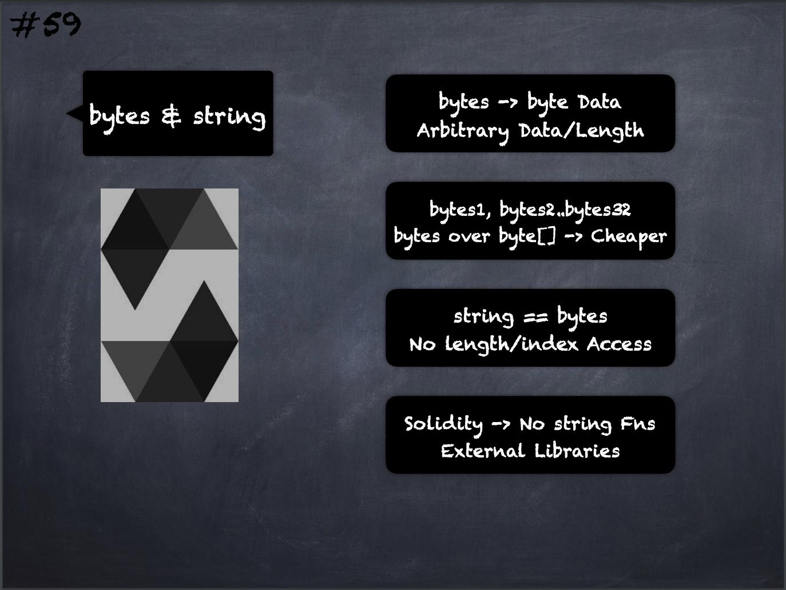

# 59 - [bytes & string](bytes%20&%20string.md)
Variables of type `bytes` and `string` are special arrays

1.  `bytes` is similar to `byte[]`, but it is packed tightly in calldata and memory
    
2.  `string` is equal to `bytes` but does not allow length or index access
    
3.  Solidity does not have string manipulation functions, but there are third-party string libraries
    
4.  Use `bytes` for arbitrary-length raw byte data and `string` for arbitrary-length string (UTF-8) data
    
5.  Use `bytes` over `byte[]` because it is cheaper, since `byte[]` adds 31 padding bytes between the elements
    
6.  If you can limit the length to a certain number of bytes, always use one of the value types `bytes1` to `bytes32` because they are much cheaper

___
## Slide Screenshot

___
## Slide Deck
- bytes -> bytes Data
- Arbitrary Data/Length
- `bytes1`, `bytes2..bytes32`
- `bytes` over `byte[]` -> Cheaper
- `string == bytes`
- No length/Index Access
- Solidity -> No built-in String Manipulation Functions
- External Libraries
___
## References
- Youtube Reference

