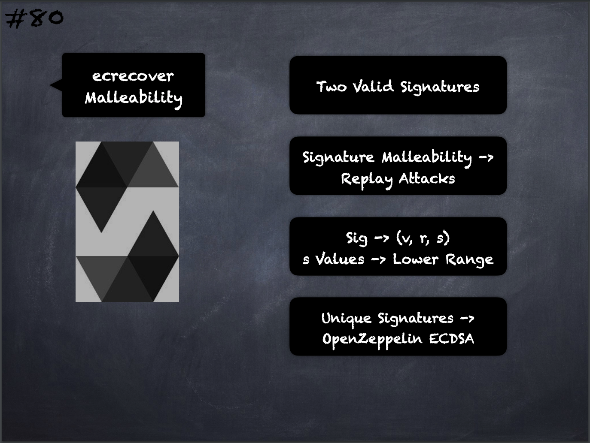

# 80 - [ecrecover Malleability](ecrecover%20Malleability.md)
If you use `ecrecover`, be aware that a valid signature can be turned into a different valid signature without requiring knowledge of the corresponding private key. This is usually not a problem unless you require signatures to be unique or use them to identify items. OpenZeppelin has a ECDSA helper library that you can use as a wrapper for `ecrecover` without this issue.
___
## Slide Screenshot

___
## Slide Deck
- Two Valid Signatures
- Signature Malleability -> Replay Attacks
- Sig -> (v, r, s)
- s Values -> Lower Range
- Unique Signatures -> OpenZeppelin ECDSA
___
## References
- [Youtube Reference](https://youtu.be/WgU7KKKomMk?t=1854)

___
## Resources
- 
