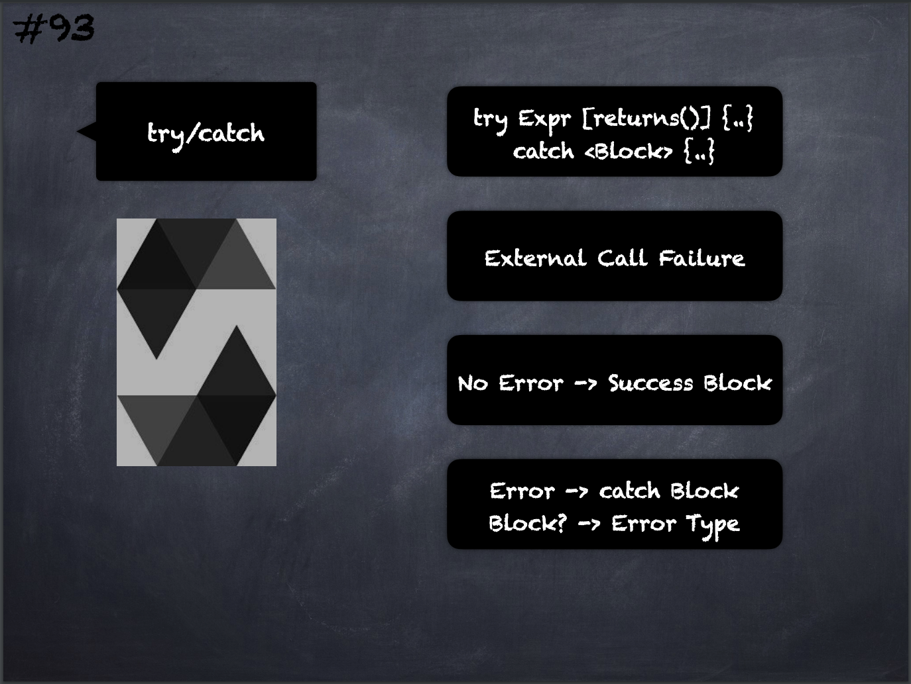

# 93 - [try/catch](try-catch.md)
The `try` keyword has to be followed by an expression representing an external function call or a contract creation (`new ContractName()`).

Errors inside the expression are not caught (for example if it is a complex expression that also involves internal function calls), only a revert happening inside the external call itself. 

The returns part (which is optional) that follows declares return variables matching the types returned by the external call. 

In case there was no error, these variables are assigned and the contract’s execution continues inside the first success block.

If the end of the success block is reached, execution continues after the `catch` blocks.

___
## Slide Screenshot

___
## Slide Deck
- `try Expr [returns()] {..}`
- `catch <Block> {..}`
- External Call Failure
- No Error -> Success Block
- Error -> [Catch Blocks](catch%20Blocks.md)
- Block? -> Error Type
___
## References
- [Youtube Reference](https://youtu.be/_oN7XuyhoZA?t=1013)
- [Solidity by Example - Try Catch](https://solidity-by-example.org/try-catch/)
## Solidity by Example
```solidity
// SPDX-License-Identifier: MIT
pragma solidity ^0.8.3;

// External contract used for try / catch examples
contract Foo {
    address public owner;

    constructor(address _owner) {
        require(_owner != address(0), "invalid address");
        assert(_owner != 0x0000000000000000000000000000000000000001);
        owner = _owner;
    }

    function myFunc(uint x) public pure returns (string memory) {
        require(x != 0, "require failed");
        return "my func was called";
    }
}

contract Bar {
    event Log(string message);
    event LogBytes(bytes data);

    Foo public foo;

    constructor() {
        // This Foo contract is used for example of try catch with external call
        foo = new Foo(msg.sender);
    }

    // Example of try / catch with external call
    // tryCatchExternalCall(0) => Log("external call failed")
    // tryCatchExternalCall(1) => Log("my func was called")
    function tryCatchExternalCall(uint _i) public {
        try foo.myFunc(_i) returns (string memory result) {
            emit Log(result);
        } catch {
            emit Log("external call failed");
        }
    }

    // Example of try / catch with contract creation
    // tryCatchNewContract(0x0000000000000000000000000000000000000000) => Log("invalid address")
    // tryCatchNewContract(0x0000000000000000000000000000000000000001) => LogBytes("")
    // tryCatchNewContract(0x0000000000000000000000000000000000000002) => Log("Foo created")
    function tryCatchNewContract(address _owner) public {
        try new Foo(_owner) returns (Foo foo) {
            // you can use variable foo here
            emit Log("Foo created");
        } catch Error(string memory reason) {
            // catch failing revert() and require()
            emit Log(reason);
        } catch (bytes memory reason) {
            // catch failing assert()
            emit LogBytes(reason);
        }
    }
}
```


