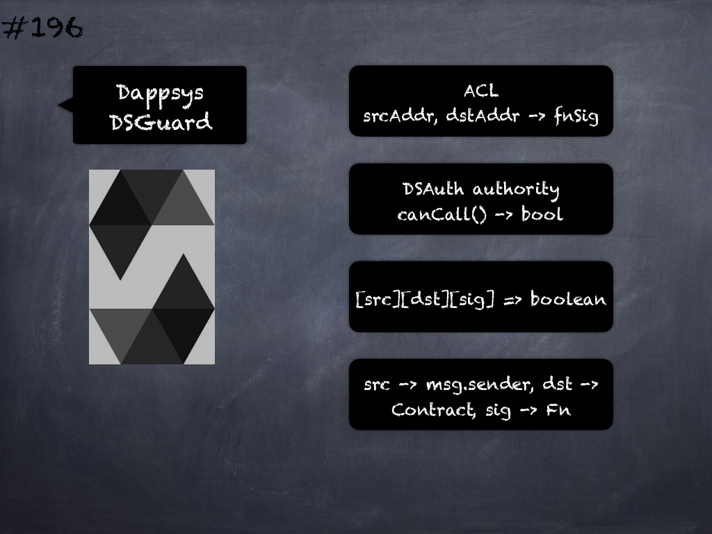

# 196 - [Dappsys DSGuard](Dappsys%20DSGuard.md)
Dappsys DSGuard: Manages an Access Control List which maps source and destination addresses to function signatures. 

Intended to be used as an authority for DSAuth where it acts as a lookup table for the _canCall_ function to provide boolean answers as to whether a particular address is authorized to call a given function at another address. 

The ACL is a mapping of _[src][dst][sig] => boolean_ where an address src can be either permitted or forbidden access to a function _sig_ at address _dst_ according to the boolean value. 

When used as an authority by DSAuth the _src_ is considered to be the _msg.sender_, the _dst_ is the including contract and _sig_ is the function which invoked the auth modifier.
___
## Slide Screenshot

___
## Slide Deck

___
## References
- Youtube Reference
___
## Tags