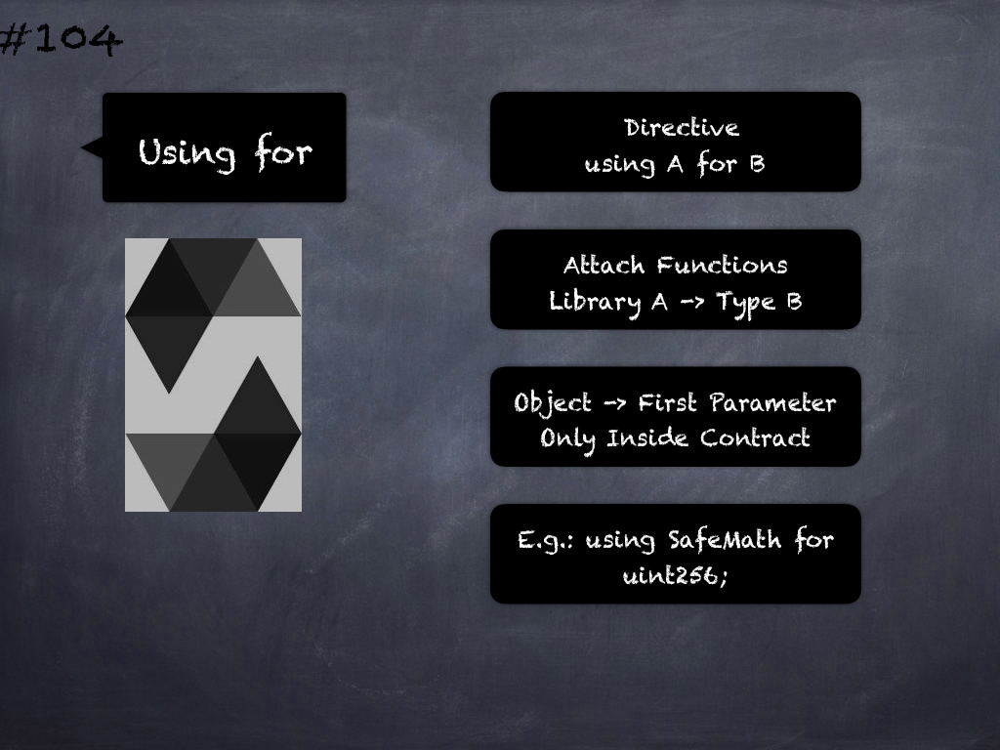

# 125 - [EVM Memory](EVM%20Memory.md)
[EVM](../Ethereum101/EVM.md) memory is linear and can be addressed at byte level and accessed with MSTORE/MSTORE8/MLOAD instructions. 

All locations in memory are initialized as zero.

___
## Slide Screenshot

___
## Slide Text
- EVM Memory
	- Linear Layout
- Addressed -> Byte Level
- MLOAD/MSTORE/MSTORE8
- Zero Initialized
___
## References
- [Youtube Reference](https://youtu.be/TqMIbouwePE?t=497)
___
## Tags
[Memory](../Ethereum101/Memory.md), [Stack Memory, Storage, and Flow Operations](../Ethereum101/Stack%20Memory,%20Storage,%20and%20Flow%20Operations.md), [Memory Layout](Memory%20Layout.md)[Reserved Memory](Reserved%20Memory.md), [Zeroed Memory](Zeroed%20Memory.md)