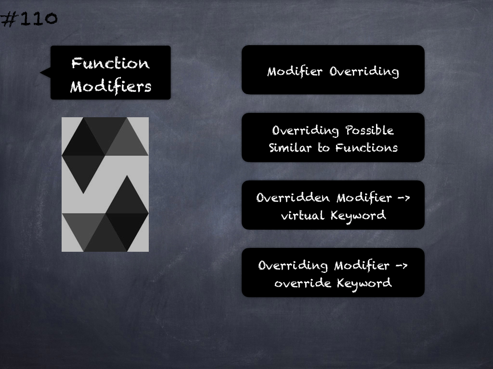

# 110 - [Function Modifiers](Function%20Modifiers.md)
Modifier Overriding: Function modifiers can override each other. 

This works in the same way as function overriding (except that there is no overloading for modifiers). 

The virtual keyword must be used on the overridden modifier and the override keyword must be used in the overriding modifier.

___
## Slide Screenshot

___
## Slide Deck
- Modifier Overriding
- Overriding Possible
- Similar to Functions
- Overridden Modifier -> virtual Keyword
- Overriding Modifier -> override Keyword
___
## References
- [Youtube Reference](https://youtu.be/3bFgsmsQXrE?t=768)
___
## Tags