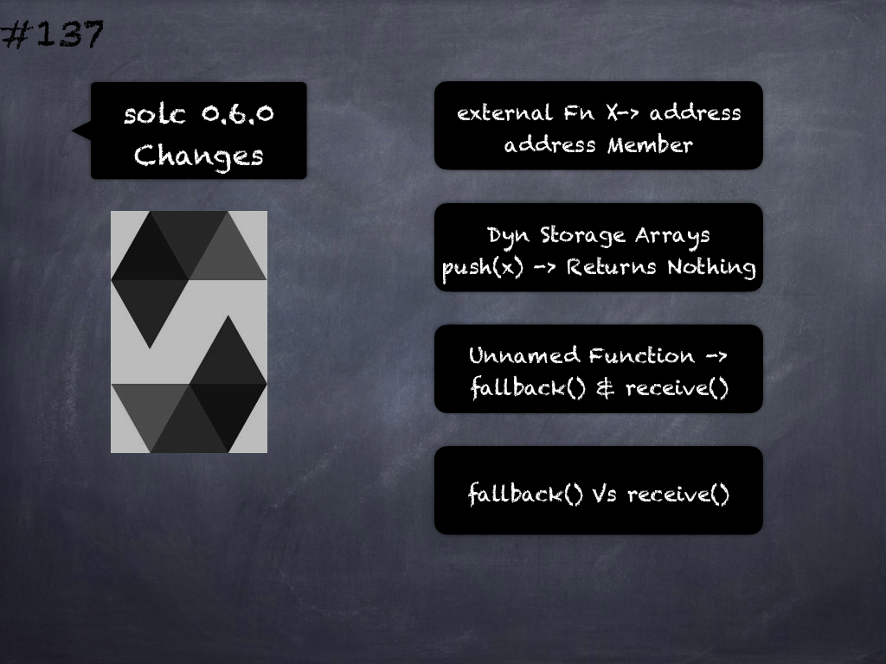

# 132 - [Inline Assembly](Inline%20Assembly.md)
Inline assembly is a way to access the Ethereum Virtual Machine at a low level. 

This bypasses several important safety features and checks of Solidity. 

You should only use it for tasks that need it, and only if you are confident with using it.

1. The language used for inline assembly in Solidity is called Yul
    
2. An inline assembly block is marked by `assembly { ... }`, where the code inside the curly braces is code in the Yul language

___
## Slide Screenshot

___
## Slide Deck
- Access EVM Low-level Features
- Bypasses Safety Features
- E.g.: Type Safety
- Language -> Yul
- Assembly Block `assembly {...}`
___
## References
- [Youtube Reference](https://youtu.be/TqMIbouwePE?t=1026)
___
## Tags