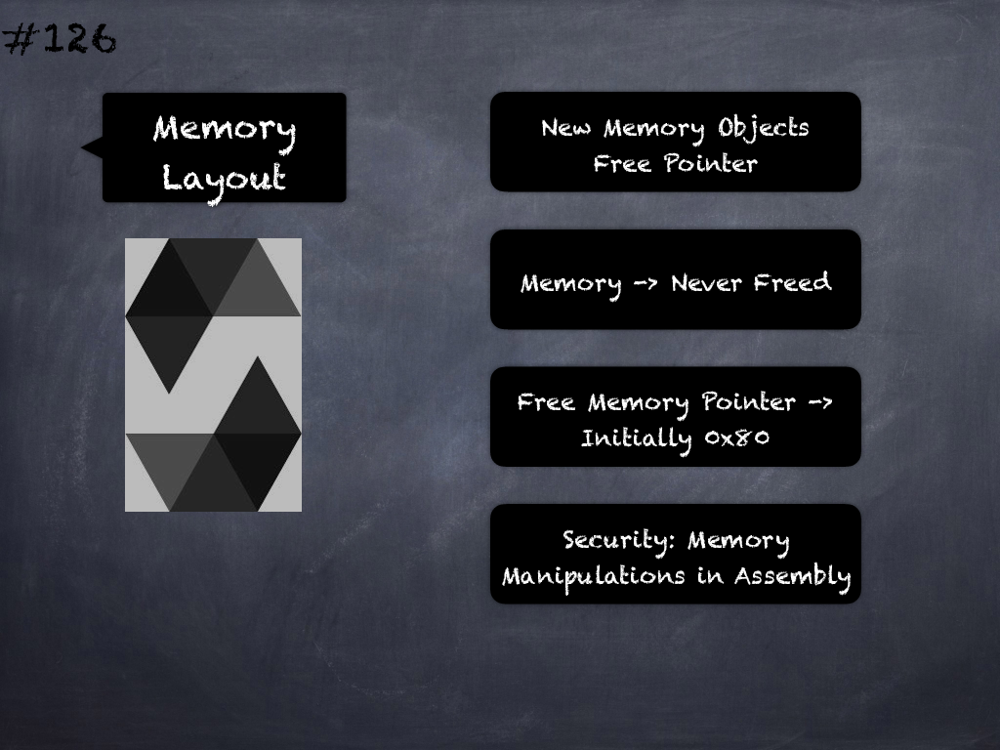

# 120 - [Layout & Ordering](Layout%20&%20Ordering.md)
Storage Layout & Ordering: Ordering of storage variables and struct members affects how they can be packed tightly. 

For example, declaring your storage variables in the order of `uint128`, `uint128`, `uint256` instead of `uint128`, `uint256`, `uint128`, as the former will only take up two slots of storage whereas the latter will take up three.
___
## Slide Screenshot

___
## Slide Deck
- State Vars Ordering
- Declaration -> Packing
- Packing -> Gas Costs
- SLOADs & SSTOREs
- `uint128`, `uint128`, `uint256`
	- Two Storage Slots
- `uint128`, `uint256`, `uint128`
	- Three Storage Slots
___
## References
- [Youtube Reference](https://youtu.be/3bFgsmsQXrE?t=1468)
___
## Tags