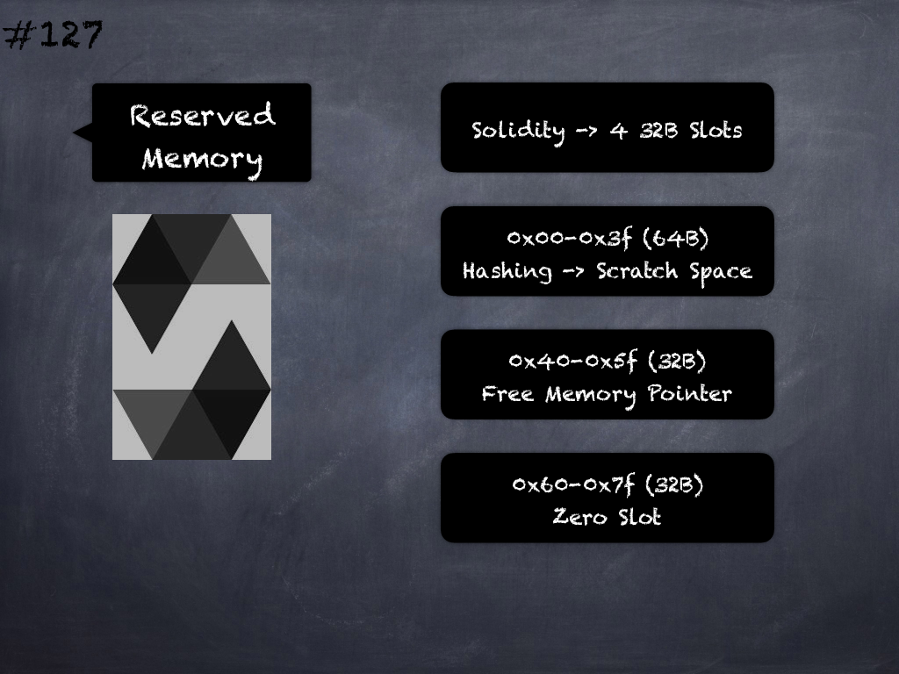

# 121 - [Mappings & Dynamic Arrays](Mappings%20&%20Dynamic%20Arrays.md)
Storage Layout for Mappings & Dynamically-sized Arrays: Due to their unpredictable size, mappings and dynamically-sized array types cannot be stored “in between” the state variables preceding and following them. 

Instead, they are considered to occupy only 32 bytes with regards to the rules above and the elements they contain are stored starting at a different storage slot that is computed using a Keccak256 hash.

___
## Slide Screenshot

___
## Slide Deck
- Storage Layout
- Unpredictable Size
- Cannot be Stored In-Between Others
- Occupy -> 32 Bytes
- Elements -> Elsewhere
- Elements -> Starting Slot
- Keccak256 Hash
___
## References
- [Youtube Reference](https://youtu.be/TqMIbouwePE)
___
## Tags