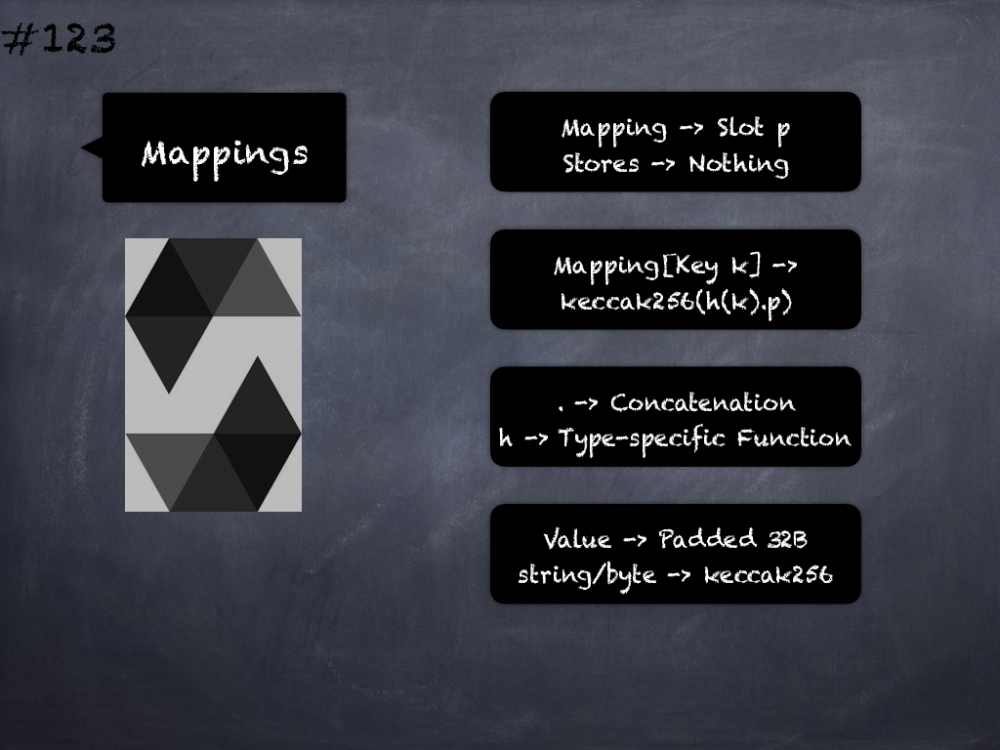

# 123 - [Mappings Continued](Mappings%20Continued.md)
Storage Layout for Mappings: For mappings, the slot stays empty, but it is still needed to ensure that even if there are two mappings next to each other, their content ends up at different storage locations. The value corresponding to a mapping key k is located at `keccak256(h(k) . p)` where `.` is concatenation and `h` is a function that is applied to the key depending on its type: 

1. For value types, `h` pads the value to 32 bytes in the same way as when storing the value in memory.
2. For strings and byte arrays, `h` computes the `keccak256` hash of the unpadded data. 

If the mapping value is a non-value type, the computed slot marks the start of the data. 

If the value is of struct type, for example, you have to add an offset corresponding to the struct member to reach the member.

___
## Slide Screenshot

___
## Slide Deck
- Mapping -> Slot p
	- Stores -> Nothing
- `Mapping[Key k]` -> `keccak256(h(k).p)`
- `.` -> Concatenation
- h -> Type-specific Function
- Value -> Padded 32 Bytes
- string/byte -> keccak256
___
## References
- [Youtube Reference](https://youtu.be/TqMIbouwePE?t=159)
___
## Tags