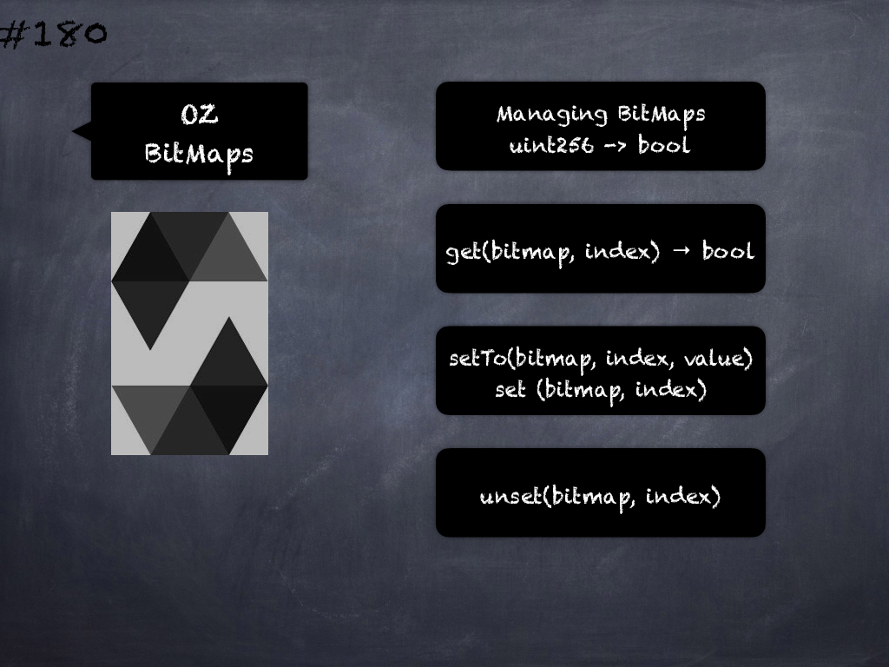

# 180 - [OZ Bitmaps](OZ%20Bitmaps.md)
OpenZeppelin BitMaps: Library for managing uint256 to bool mapping in a compact and efficient way, providing the keys are sequential.

1.  struct BitMap: mapping(uint256 => uint256) _data;
    
2.  get(BitMap storage bitmap, uint256 index) → _bool:_ Returns whether the bit at `index` is set.
    
3.  setTo(BitMap storage bitmap, uint256 index, bool value): Sets the bit at `index` to the boolean `value`
    
4.  function set(BitMap storage bitmap, uint256 index): Sets the bit at `index`
    
5.  function unset(BitMap storage bitmap, uint256 index): Unsets the bit at `index`

___
## Slide Screenshot

___
## Slide Deck

___
## References
- Youtube Reference
___
## Tags